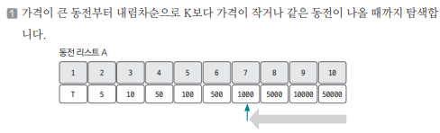
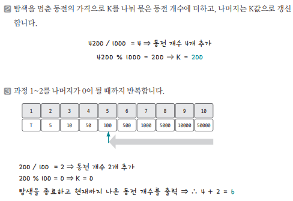

[링크](https://www.acmicpc.net/problem/11047)

## 1. 문제 분석

동전 종류 N개, 가격의 합 K, 동전의 가격 Ai(Ai는 A(i-1)의 배수)

각 종류별 동전의 개수는 신경쓰지 않아도 된다. 이때, 동전을 적절히 사용해 가격의 합을 K로 만들려고 한다. 이때, 필요한 동전 개수의 최소값을 구하는 프로그램을 만들어야 한다

---

전형적인 `그리디 알고리즘` 문제

이 문제는 그리디 알고리즘으로 해결할 수 있도록 뒤의 동전 가격 A_i가 앞에 나오는 동전 가격 A_(i-1)의 배수가 된다는 조건을 부여했다. 

즉, 동전을 최소로 사용하여 K를 만들기 위해서는 가장 가격이 큰 동전부터 차례대로 사용하면 된다.


## 2. 손으로 풀어보기 





## 3. 슈도코드 

``` 
N : 동전 개수 
K : 목표 금액 
A : 동전 데이터 리스트 

for N만큼 반복 : 
    A 리스트 저장 

# 가격이 큰 동전부터 선택해서 개수를 최소로 구성한다
for N만큼 반복 # N-1 -> 0으로 역순으로
    if 현재 K >= 동전 가치 : 
        동전 수 += 목표 금액 / 현재 동전 가치 
        목표 금액 = 목표 금액 & 현재 동전 가치
```

[코드](../../code/day10/32_동전개수의최솟값구하기.py)

### 그리디 알고리즘에서 자주 사용하는 자료구조 : 우선순위 큐]

그리디 알고리즘은 현재 상황에서 최선의 선택을 반복하는 알고리즘이다.  
때문에 `우선순위 큐`를 사용하여 문제를 해결하는 경우가 많다. 

Python에서는 아래의 2가지 방법으로 우선순위 자료구조를 제공한다.

1. PriorityQueue

``` python
from queue import PriorityQueue

myque = PriorityQueue()

put(data) # 원소 추가
get()     # 큐에서 데이터 꺼내기 
qsize()   # 큐 사이즈 
empty()   # 큐가 비어 있는지 확인
```

2. heapq 

``` python
import heapq 

mylist = []                 # 리스트 생성 
headq.heappush(mylist, 1)   # 리스트에 데이터를 넣을 때 headq를 이용해서 저장

heappush(mylist, data)      # data를 list(heap 자료구조) 형태로 저장
heappop(mylist)             # list(heap 자료구조)에서 데이터 꺼내기
heapify(mylist)             # 일반적인 list를 heap 자료구조로 변환
```

