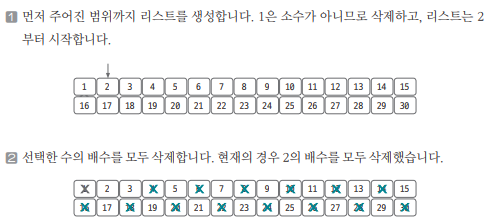
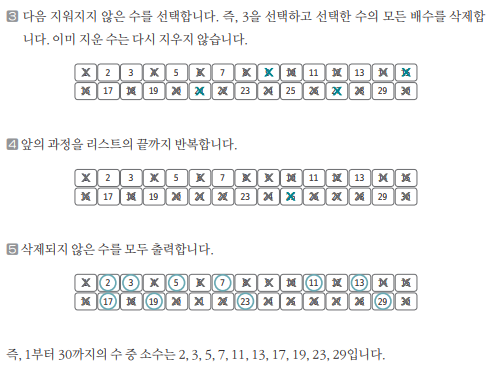

`소수(prime number)` : 자신보다 작은 2개의 자연수를 곱해 만들 수 없는 1보다 큰 자연수 = 1과 자기 자신 외에 약수가 존재하지 않는 수

## 에라토스테네스의 체 

- 원리  
1) 구하고자 하는 소수의 범위만큼 1차원 리스트 생성  
2) 2부터 시작하고 현재 숫자가 지워진 상태가 아닌 경우현재 현재 선택된 숫자의 배수에 해당하는 수를 리스트에서 끝까지 탐색하면서 지운다. 이때, 처음으로 선택된 숫자는 지우지 않는다.  
3) 리스트의 끝까지 2)번 과정을 반복해서 리스트에 남아있는 모든 수를 출력한다

ex. 1~30까지의 숫자 중 소수를 구하는 방법 

- 에라토스테네스의 체의 시간복잡도 

==> 일반적으로 `O(Nlog(logN))`  
==> 배수를 삭제하는 연산으로 실제 구현에서 바깥쪽 for문을 생략하는 경우가 빈번하게 발생하기 때문이다