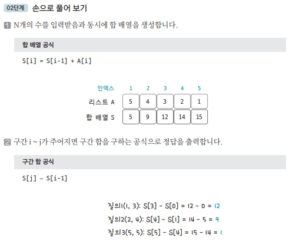

[링크](https://www.acmicpc.net/problem/11659)

## 1. 문제 분석

수의 개수, 합을 구해야 하는 횟수의 `최대값이 10만`이다.  
그런데, 하나의 숫자들에 대해 여러 번의 구간합을 매번 계산한다면 0.5초만에 모든 구간 합 계산을 끝낼 수 없다.

따라서 `구간 합 이론`을 이용해야 한다. 

## 2. 손으로 풀어보기 



## 3. 슈도코드 

``` 
suNo : 숫자 개수
quizNo : 질의 개수 

numbers : 숫자 데이터 저장하는 리스트 

prefix_sum : 합 배열

temp 변수 선언 

for 저장한 숫자 데이터 차례대로 탐색 : 
    temp <- 현재 숫자 데이터를 더한다
    합 배열에 temp값 저장 

for 질의 개수만큼 반복 : 
    질의 범위 받기 (start, end) 
    구간 합 출력 : print(prefix_sum[end] - prefix_sum[start-1])

```

[코드](../../code/day2/3_구간합구하기1.py)