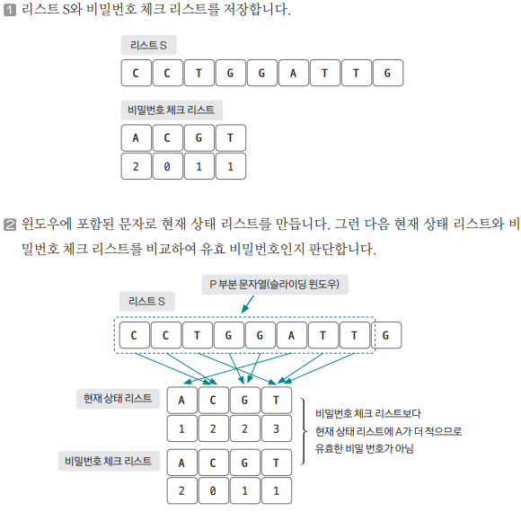

[링크](https://www.acmicpc.net/problem/12891)

## 1. 문제 분석

- S : 민호가 임의로 만든 DNS 문자열 (문자열의 길이는 최대 100만)
- P : 비밀번호로 사용할 부분의 문자열 (문자열의 길이는 최대 100만) 

그리고 당연히 (P의 길이) <= (S의 길이)를 만족한다. 

S와 P의 길이가 100만으로 매우 크기 때문에 반드시 `O(n) 시간복잡도` 알고리즘으로 문제를 해결해야 한다. 

이때, 부분 문자열의 길이가 P이므로 `슬라이딩 윈도우 개념`을 이용하면 문제를 쉽게 해결할 수 있다. 


1) 길이가 P인 윈도우를 지정해서 리스트 S의 시작점에 놓는다.  
2) 윈도우를 오른쪽으로 밀면서 윈도우 안에 있는 값들이 조건에 맞는지 탐색한다. 

이렇게 탐색을 진행하면 `O(n) 시간 복잡도`로 문제를 해결할 수 있다. 

## 2. 손으로 풀어보기 



3. 윈도우를 1칸씩 이동하면서 현재 상태 리스트를 업데이트한다.  

업데이트 한 이후에는 비밀번호 체크 리스트와 비교하여 비밀번호의 유효성을 판단한다. 

유효성을 판단하는 방법은 기존에 있던 상태 리스트에서 어떤 문자가 빠지고 어떤 문자가 추가되는지만 확인하고 내용을 갱신해나가면 된다. 


ex) 윈도우가 1칸 이동해서 C가 빠지고 G가 추가되면서 현재 상태 리스트가 업데이트된 상황  


## 3. 슈도코드 

``` 
# 전역 변수 선언
checkList : 비밀번호 체크 리스트 
myList : 현재 상태 리스트 
checkSecret : 몇 개의 문자와 관련된 개수를 충족했는지 판단하는 변수 

# 함수 선언 
myAdd(문자 더하기 함수) : 
    myList에 새로운 값을 더하고 조건에 따라 checkSecret값 업데이트 

myRemove(문자 빼기 함수) : 
    myList에 새로운 값을 제거하고 조건에 따라 checkSecret값 업데이트 

# 메인 코드 
S : 문자열 크기 
P : 부분 문자열 크기 
A : 문자열 데이터 

checkList 데이터 받기 
checkList를 탐색해서 값이 0인 데이터의 개수만큼 checkSecret 값 증가 # 값이 0이라는 건 비밀번호 개수가 이미 만족되었다는 뜻 

P 범위(0 ~ P-1)만큼 myList 및 checkSecret에 적용해서 유효한 비밀번호인지 판단 

for i를 P에서 S까지 반복 : 
    j 선언 (i - P)

    한 칸씩 이동하면서 제거되는 문자열과 새로 들어오는 문자열을 처리 
    유효한 비밀번호인지(checkSecret == 4) 판단해서 결과값을 업데이트 

print(결과값)

```

[코드](../../code/day3/9_DNA비밀번호.py)