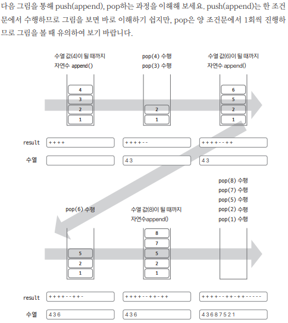

[링크](https://www.acmicpc.net/problem/1874)

## 1. 문제 분석

스택의 pop, push 연산과 `LIFO(후입선출)` 개념을 이해하고 있다면 쉽게 해결할 수 있다. 

스택에 넣는 값이 `오름차순 정렬`이어야 한다는 것에 유념하며 문제를 풀어보자

## 2. 손으로 풀어보기 

- 핵심 내용 : 1부터 자연수를 증가시키면서 입력으로 주어진 숫자와 비교하여 증가시킨 자연수를 스택에 추가 또는 빼는 방식

스택 연산은 아래의 2가지 방법으로 수행한다.

1. 현재 수열 값 >= 자연수   
==> 자연수를 1씩 증가 & 자연수를 스택에 push   
==> push가 끝나면 수열을 출력하기 위해 마지막 1회만 pop 

ex) 현재 수열 값이 4인 경우 
==> 스택에 1, 2, 3, 4를 push & 마지막 1회만 pop하여 4를 출력  
==> 조건문을 빠져나온다  
==> 자연수는 5가 된다.

2. 현재 수열 값 < 자연수  
==> pop으로 스택에 있는 값을 꺼낸다.  
==> 이때, 꺼낸 값이 현재 수열 값이거나 아닐 수 있다.  
==> 만약 현재 수열 값이라면 그대로 조건문을 빠져나온다.  
==> 만약 아니라면 LIFO 원리에 따라 수열을 표현할 수 없으므로 `NO를 
출력`하면서 문제를 종료한다.  

==> 현재 자연수는 5, 수열 값은 3이므로 스택에서 3을 꺼낸다  
==> 현재 수열 값과 스택에서 꺼낸 값이 같으므로 계속해서 스택 연산을 수행할 수 있다. 

스택에는 1, 2가 남았고 자연수는 5다



## 3. 슈도코드 

``` 
N : 수열 개수 
A : 수열 리스트 

A 수열 리스트 채우기 

for N만큼 반복 : 
    if 현재 수열 값 >= 오름차순 자연수 : 
        while 현재 수열 값 >= 오름차순 자연수 : 
            append()
            오름차순 자연수 1 증가
            (+) 저장
        
        pop()
        (-)저장

    else : # 현재 수열 값 < 오름차순 자연수 : 
        pop()
        if 스택에서 pop했을 때 결과값 > 수열의 수 :
            NO 출력
        else : 
            (-) 저장

if NO값을 출력한 적이 없다면 : 
    저장한 값 출력
```

[코드](../../code/day4/11_스택으로수열만들기.py)