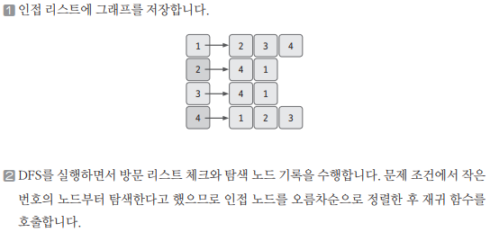
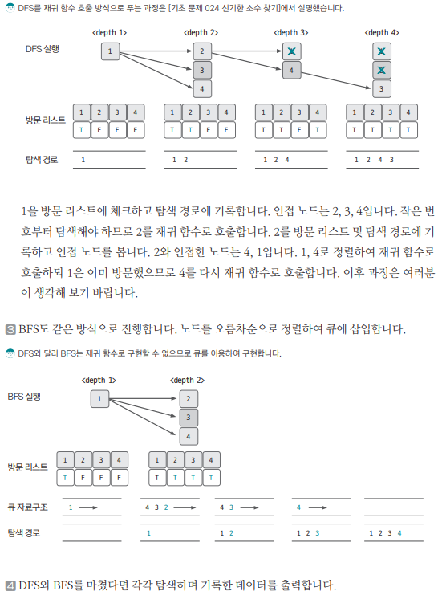

[링크](https://www.acmicpc.net/problem/1260)

## 1. 문제 분석

DFS와 BFS를 구현할 수 있는지 대놓고 물어보는 문제

## 2. 손으로 풀어보기 





## 3. 슈도코드 

- 내가 작성한 슈도 코드 
``` 
N(노드 개수); M(엣지 개수); V(탐색을 시작할 정점의 번호)

visited : 방문 기록을 저장하는 리스트
A = 인접리스트 형태로 저장할 그래프 

def DFS(n) : 

    visited[n] = True
    print(n, end = ' ')

    for n의 이웃한 노드(오름차순 정렬) : 
        if not visited[이웃노드] : 
            DFS(이웃노드)

visited 리스트 초기화 

que = 큐 초기화 

def BFS(start) : 

    visited[start] = True # 시작 노드 방문
    que.enqueue(start) # 큐에 시작 노드 삽입 
    
    while que가 비어있지 않다면 : 

        node = que.pop()
        print(node, end = ' ')

        for node의 이웃한 노드에 대해 반복 : 

            # 아직 이웃한 노드에 방문한 적 없다면
            if not visited[이웃한 노드] : 
                visited[이웃한 노드] = True
                que.enqueue(이웃한 노드)

```

- 모범답안 
```
N(노드 개수); M(엣지 개수); Start(탐색을 시작할 정점의 번호)
A = 인접리스트 형태로 저장할 그래프

for M의 개수만큼 반복 : 
    A 인접 리스트에 그래프 데이터 저장 

for N+1의 개수만큼 반복 : 
    각 노드와 관련된 엣지를 정렬 

visited : 방문 기록을 저장하는 리스트

def DFS() :
    현재 노드 출력 
    visited[현재노드] = True 

    현재 노드의 연결 노드 중 방문하지 않은 노드에 DFS 실행

visited 리스트 초기화 
DFS(Start) 실행 

def BFS() : 
    큐 자료구조에 시작 노드 삽입
    visited[현재 노드 방문]

    while 큐가 비어있을 때까지 : 
        큐에서 노드 데이터 pop
        가져온 노드 출력
        현재 노드의 연결 노드 중 방문하지 않은 노드 큐에 삽입 & visited에 기록 

visited 리스트 초기화
BFS(Start) 실행

```

[코드](../../code/폴더/파일이름.py)