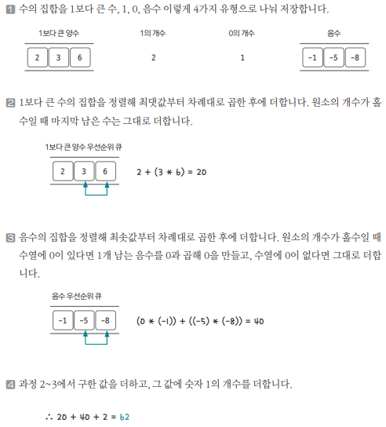

[링크](https://www.acmicpc.net/problem/1744)

## 1. 문제 분석

ex. 주어진 수얼 {0, 1, 2, 4, 3, 5}일 때 

- 수열의 합 = 15 
- 2, 3을 묶고 4, 5를 묶은 후 계산 : 0 + 1 + (2×3) + (4×5) = 27
    - 여기서 `묶는 동작`은 위치에 상관없이 묶을 수 있음

주어진 수열의 각 수를 적절히 묶어 그 합을 최대로 만드는 프로그램을 작성하자

---

N의 최댓값이 1만이라서 시간 복잡도 제약과는 크게 상관없다.

문제를 보면 가능한 한 큰 수들끼리 묶어야 결과값이 커진다는 걸 확인할 수 있다. 

ex. 1,2,3,4 가 주어졌다면 1×4 + 2×3 < 1×2 + 3×4 라는 걸 알 수 있다. 

또한 음수끼리 곱하면 양수로 변하는 성질을 추가로 고려해줘야 겠다.

## 2. 손으로 풀어보기 



## 3. 슈도코드 

``` 
N : 카드 묶음 개수
plusPq : 양수 우선순위 큐
minusPq : 음수 우선순위 큐
one : 1의 개수 카운트
zero : 0의 개수 카운트

for N만큼 반복 : 
    # 양수 우선순위 큐는 내림차순 정렬을 위해 -1을 곱해서 저장
    데이터를 4개의 그룹에 분리해서 저장 

# 양수 우선순위 큐 처리
while plusPq.qsize() < 2 : 
    # 내림차순 정렬을 위해 -1을 곱했기 때문에 원상복구를 위해 -1을 곱한다
    숫자 2개를 큐에서 뽑는다 

    2개의 숫자를 곱한 값을 결과값에 더한다

if 양수 우선순위 큐에 데이터가 남아있다면 : 
    해당 데이터를 결과값에 더한다

# 음수 우선순위 큐 처리 
while minusPq.qsize() < 2 : 
    숫자 2개를 큐에서 뽑는다

    2개의 숫자를 곱한 값을 결과값에 더한다

if 음수 우선순위 큐에 데이터가 남아있고, 숫자 0이 하나도 없다면 : 
    해당 데이터를 결과값에 더한다

숫자 1의 개수를 결과값에 더한다

print(결과값)
```

[코드](../../code/day10/34_수를묶어서최댓값만들기.py)