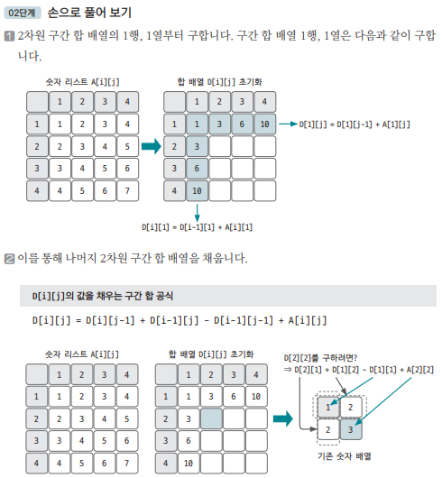
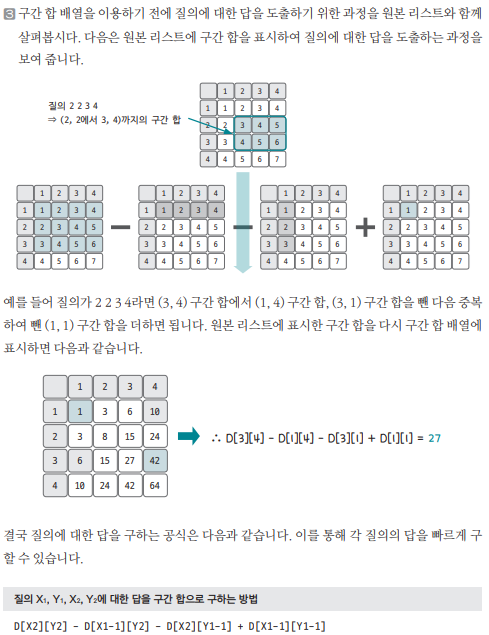

[링크](https://www.acmicpc.net/problem/11660)

## 1. 문제 분석

질의 개수가 `10만개`라서 질의마다 합을 구하면 시간 초과 문제가 발생한다.  
때문에 `구간 합 배열`을 이용해야 하는데... 이전과 달리 `2차원` 구간 합 배열을 이용해야 한다. 

2차원 구간 합 배열은 다음과 같이 정의할 수 있다. 

```
D[X][Y] = 원본 배열의 (0, 0) ~ (X, Y)까지의 사각형 영역 안에 있는 수의 합
```

## 2. 손으로 풀어보기 



2번 과정에 대한 설명 : (X, Y) 좌표의 구간 합 = (해당 좌표의 왼쪽 구간합) + (해당 좌표의 위 구간합) - (해당 좌표의 왼쪽 위 대각선 구간합)

(해당 좌표의 왼쪽 위 대각선 구간합)을 빼는 이유는  
(해당 좌표의 왼쪽 구간합) + (해당 좌표의 위 구간합)에서 2번 더해진 값이기 때문이다.




## 3. 슈도코드 

``` 
n : 리스트의 크기 
m : 질의 수 

A : 원본 리스트 
D : 합 배열 

for n만큼 반복 : 
    원본 리스트 데이터 저장 

for i in range(1, n+1) : 
    for j in range(1, n+1) : 
        합 배열 저장
        D[i][j] = D[i][j-1] + D[i-1][j] - D[i-1][j-1] + A[i][j]

for m만큼 반복 : 
    질의에 대한 결과 계산 및 출력 
    결과 = D[x2][y2] - D[x1-1][y2] - D[x2][y1-1] + D[x1-1][y1-1]
```

[코드](../../code/day2/4_구간합구하기2.py)