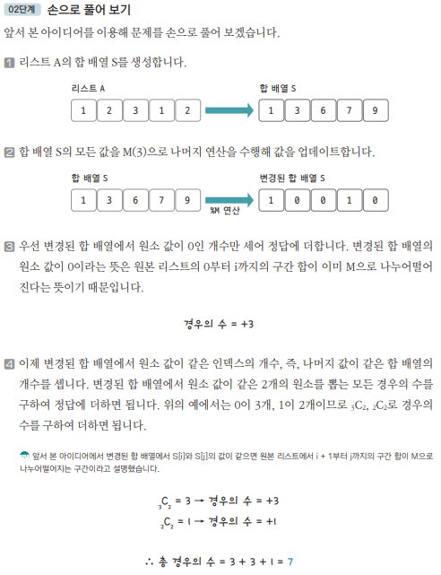

[링크](https://www.acmicpc.net/problem/10986)

## 1. 문제 분석

숫자 N개 A1, A2, ..., AN이 주어진다.  
이때, 연속된 부분 구간의 합이 M으로 나눠 떨어지는 구간의 개수를 구하는 프로그램을 작성하시오. 

=> Ai + ... + Aj (i ≤ j) 의 합이 M으로 나누어 떨어지는 (i, j) 쌍의 개수 구하기

---

숫자 개수의 최댓값은 `106개`라고 했다.   
하지만, 106개의 숫자에 대해 모든 구간의 합을 구해야 한다면 1초 안에 연산하기는 어렵다. 때문에 `구간 합`을 이용해야 한다. 

- 핵심 아이디어 

```
1. (A+B) % C = {(A%C) + (B%C)} % C  
⇒ 두 숫자의 합에 나머지 연산 결과 값 == 각 숫자들의 나머지 연산 결과의 합에 나머지 연산한 값

2. S[i] - S[j] : 원본 리스트의 j+1부터 i까지의 구간 합 

3. S[i] % M = S[j] % M 이면, (S[i] - S[j]) % M = 0 이다.   

즉, 구간 합 배열의 원소를 M으로 나눈 나머지로 업데이트하고  
S[i]와 S[j]가 동일한 (i, j) 쌍을 찾으면 원본 리스트에서 (j+1)~i까지의 구간 합이 M으로 나눠떨어진다는 걸 알 수 있다. 
```

## 2. 손으로 풀어보기 



3번 내용 : 0 ~ i까지의 구간 합이 M으로 나눠떨어지는 경우의 수를 구한 상황

4번 내용 : 핵심 아이디어 2, 3번의 내용을 결합해서 구현한 내용  
- 나머지가 0인 개수 3개 => 그 중에 2개를 선택하는 경우의 수를 구했다  
- 나머지가 1인 개수 2개 => 그 중에 2개를 선택하는 경우의 수를 구했다
```
S[i] % M = S[j] % M 이면, (S[i] - S[j]) % M = 0 이다.
즉, ((j+1) ~ i까지의 구간 합)이 M으로 나눠떨어진다
```

즉, 4번 내용은 j+1 ~ i까지의 구간 합이 M으로 나눠떨어지는 경우의 수를 구하는 상황이다.

그걸 다 더한 값이 정답이 된다.

## 3. 슈도코드 

``` 
n : 수열의 개수 
m : 나눠떨어져야 하는 수 

A : 원본 수열 저장 리스트
S : 합 배열 
C : 같은 나머지 인덱스를 카운트하는 리스트 

answer : 정답 변수

# 합 배열을 만드는 부분
for i in range(1, n) : 
    S[i] = S[i-1] + A[i]

# 0~i 까지의 구간 합이 M으로 나눠떨어지는 경우의 수를 구하는 부분
for i in range(n) : 
    remainder = S[i] % M 
    if (remainder == 0) : 
        answer += 1 
    C[remainder] += 1 # 나머지 remainder가 나오는 개수를 세는 부분

for i in range(m) :
    C[i](i가 나머지인 인덱스의 개수)에서 2가지를 뽑는 경우의 수를 정답에 더하기 

print(answer)
```


[코드](../../code/day2/5_나머지합구하기.py)
