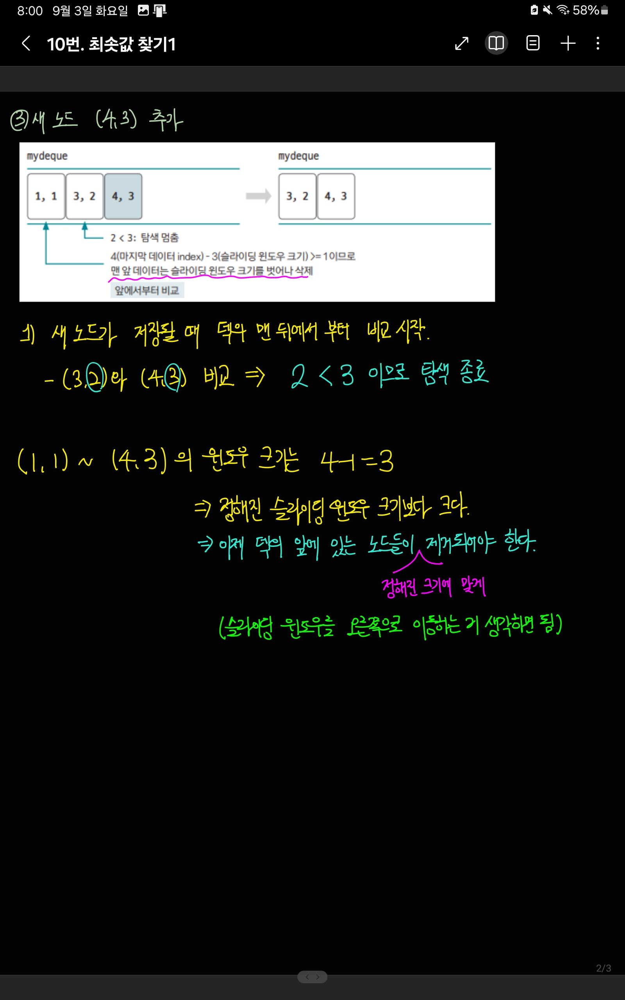

[링크](https://www.acmicpc.net/problem/11003)

## 1. 문제 분석 

N개의 수 A1, A2, ..., An과 L이 주어진다. 

Di = A_(i-L+1) ~ A_i 중의 최솟값 이라 할 때, D에 저장된 수를 출력하는 프로그램을 작성하시오

---

`일정 범위 안`에서 최솟값을 구하는 문제이다. 따라서, `슬라이딩 윈도우`와 `정렬`을 사용하면 될 것이다. 윈도우의 크기는 `i-L+1 ~ i => L`이다. 

일반적인 정렬은 `O(nlogn)`의 시간 복잡도를 가진다.  
N과 L의 `최대 범위가 500만`이기 때문에 정렬을 사용할 수 없다. 그래서 시간 복잡도 `O(n)`으로 해결해야 한다. 

이를 위해 `덱(deque)`을 구현하여 정렬 효과를 볼 수 있다. 

## 2. 손으로 풀어보기 

  
  


## 3. 슈도코드 

``` 
N = 데이터 개수
L = 최소값을 구하는 범위 (슬라이딩 윈도우 크기)
deq = 데이터를 담을 덱
now = 주어진 숫자 데이터를 갖는 리스트

for i in N : # now 리스트를 탐색하는 반복문

    덱의 마지막 위치에서부터 현재 값 보다 큰 값은 덱에서 제거
    덱의 마지막 위치에 현재 값 저장
    덱의 1번째 위치에서부터 L의 범위를 벗어난 값 제거 
    덱의 1번째 데이터 출력 
```

[코드](../../code/day3/10_최소값찾기1.py)
