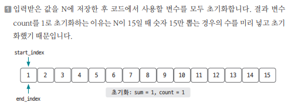
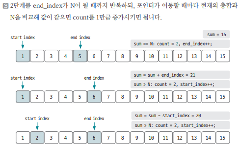

[링크](https://www.acmicpc.net/problem/2018)

## 1. 문제 분석

어떤 자연수 N은 몇 개의 연속된 자연수의 합으로 나타낼 수 있다. 이때, 자연수 N을 연속된 자연수의 합으로 나타낼 수 있는 경우의 수를 알고 싶다. 

ex) 
- 15 : 15, 7+8, 4+5+6, 1+2+3+4+5의 4가지
- 10 : 10, 1+2+3+4의 2가지

---

우선 문제에 주어진 조건들을 살펴보자.

1. 시간 제한 2초 
2. N의 최댓값 1000만 

이런 상황에서 O(nlogn)의 시간복잡도 알고리즘을 사용한다면 제한 시간을 초과한다. 때문에 `O(n)`의 시간 복잡도 알고리즘을 사용해야 한다.

==> 이런 경우 자주 사용하는 방법이 `투 포인터`이다. 

`연속된 자연수의 합`을 구하는 것이 문제이므로 `시작 인덱스`와 `종료 인덱스`를 지정해서 연속된 수를 표현해보자.

## 2. 손으로 풀어보기 



2. 투 포인터 이동 원칙은 다음과 같다.
```
- sum > N : sum -= start_index; start_index++; 
==> 왼쪽으로 이동
==> 연속된 자연수에서 왼쪽 값을 삭제하는 동작
==> 전체 합이 기준 값보다 크니까 값을 줄여주기 위한 동작이다.

- sum < N : end_index++; sum += end_index; 
==> 오른쪽으로 이동 
==> 연속된 자연수에서 오른쪽 값을 추가하는 동작
==> 전체 합이 기준 값보다 작으니까 값을 키우기 위한 동작이다.

- sum == N : end_index++; sum += end_index; count++;
==> 값이 같은 경우
==> 경우의 수를 1 증가 & 오른쪽으로 한 칸 이동
```

위 원칙을 이용해 배열의 끝까지 탐색하면서 합이 N이 되는 경우의 수를 구한다.




## 3. 슈도코드 

``` 
n 변수 저장
사용 변수 초기화 (count = 1, start_index = 1, end_index = 1, sum = 1)

while end_index != n : 
    
    if sum > n : 
        sum -= start_index
        start_index += 1
    
    elif sum < n : 
        end_index += 1
        sum += end_index
    
    else : # sum == n 
        count += 1
        end_index += 1
        sum += end_index
    
print(count)
```

[코드](../../code/day3/6_연속된자연수의합구하기.py)
