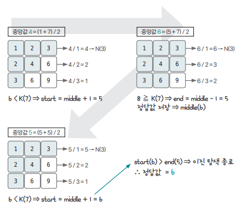

[링크](https://www.acmicpc.net/problem/1300)

## 1. 문제 분석

- k의 범위 : 1 ~ min(10^9, N^2)이기 때문에 시간복잡도가 N^2인 알고리즘을 사용할 수 없다. ==> 때문에 `이진 탐색`을 사용해야 한다.

`이진 탐색`을 이용해 중앙값보다 작은 수의 개수를 세면서 범위를 줄여나가는 방법을 통해 `B[k]`값을 구하자

즉, 작은 수의 개수가 k-1인 중앙값이 바로 정답이다.  
이 문제의 핵심은 `작은 수의 개수를 세는 아이디어`이다. 

## 2. 손으로 풀어보기 

문제의 조건에 맞는 2차원 리스트는 `N행`이 `N의 배수로 구성`되어 있다.  
따라서, 2차원 리스트의 `k번째 수`는 k를 넘지 않는다. 

즉, 2차원 리스트의 `1~k번째 안`에 `정답`이 있다.  
이점에 주목하여 이진 탐색의 시작 인덱스를 1, 종료 인덱스를 k로 정하자.

ex. N = 3, k = 7인 예시 


- 최초의 중앙값 = 4 = (1+7)/2 (단, 나눈 값이 N보다 크면 N으로 정한다)

- 1행 : 4/1 = 4 ==> 행의 개수는 3이기에 3
- 2행 : 4/2 = 2
- 3행 : 4/3 = 1

따라서, 각 행에서 중앙값 4보다 작거나 같은 수의 개수는 3+2+1 = 6개이다.  
이는 `Math.min(middle / i, N)`으로 계산된다. 

이를 통해 `중앙값 4`는 6번째 수보다 큰 수가 될 수 없다는 걸 알 수 있고  
`중앙값 4보다 큰 범위`에 `정답`이 있다는 걸 알 수 있다. 

정리.

- (중앙값보다 작은 수의 개수) < k ==> 시작 인덱스 = 중앙값 + 1
- (중앙값보다 작은 수의 개수) >= k ==> 종료 인덱스 = 중앙값 - 1

로 업데이트하면서 이진 탐색을 진행하면 된다.

- N = 3, k = 7을 찾는 과정을 보여주는 그림  


1) 중앙값 = 4 ⇒ (4보다 작거나 같은 숫자 개수) = 6 < k ⇒ (시작 인덱스) = 4+1 = 5, (종료 인덱스) = 7 
2) 중앙값 = 6 = (5+7)/2 ⇒ (6보다 작거나 같은 숫자 개수) = 8 > k ⇒ (시작 인덱스) = 5, (종료 인덱스) = 6-1 = 5 & 정답값 6으로 저장
3) 중앙값 = 5 = (5+5)/2 ⇒ (5보다 작거나 같은 숫자 개수) = 6 < k ⇒ (시작 인덱스) = 5+1 = 6, (종료 인덱스) = 5 
4) 이진 탐색 종료. 따라서, 정답은 6 

## 3. 슈도코드 

``` 
N : 리스트의 크기 
K : 구하고자 하는 index

start(시작 인덱스 = 1); end(종료 인덱스 = K)

# 이진 탐색 수행
while 시작 인덱스 <= 종료 인덱스 : 
    middle = 중간 인덱스 
    count = 중앙값보다 작은 수 

    # 중앙값보다 작은 수 계산 
    for i in range(1, N+1) : 
        count += Math.min(middle / i, N)
    
    if count < K : 
        시작 인덱스 = 중앙 인덱스 + 1 
    
    else : 
        종료 인덱스 = 중앙 인덱스 - 1 
        정답 <= 중앙값

print(정답)
```

[코드](../../code/day9/31_배열에서K번째수찾기.py)