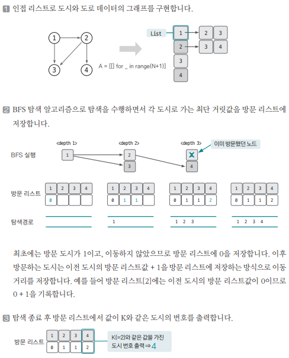

[링크](https://www.acmicpc.net/problem/18352)

## 1. 문제 분석

- 도시 개수 : N (최대 30만)
- 도로 개수 : M (최대 100만)
- 거리 정보 : K 
- 출발 도시 번호 : X 

==> 도시 X로부터 최단 거리가 K인 모든 도시를 구한다

---

문제를 바꿔서 해석하면 `가중치가 없는 그래프`를 가지고 해결하는 문제라는 걸 알 수 있다. 

또한, `도시 = 노드`, `도로 = 엣지`를 표현하는 것이다.

이때, 노드의 최대 개수는 30만, 엣지의 최대 개수는 100만이므로 BFS를 수행하면 이 문제를 시간복잡도 안에서 해결할 수 있다.

## 2. 손으로 풀어보기 



## 3. 슈도코드 

``` 
N : 노드 개수
M : 엣지 개수
K : 목표 거리
X : 시작점 

A : 그래프 데이터를 저장하는 인접 리스트
answer : 정답 리스트 
visited : 방문 거리를 저장하는 리스트 

BFS : 
    큐 자료구조에 시작 노드 삽입
    visited 리스트에 현재 노드 방문 기록 
    while 큐가 비어있을 때 까지 : 
        큐에서 노드 데이터 가져오기
        if 현재 노드와 이웃한 노드 중 아직 방문하지 않은 노드라면 : 
            visited 리스트값 1 증가
            큐에 노드 삽입 

for M만큼 반복 : 
    A 인접 리스트에 그래프 데이터 저장 

BFS(X) 실행 

for N만큼 반복 : 
    방문 거리가 K인 노드의 숫자를 정답 리스트에 추가하기 

# 문제에서 최단거리가 K인 모든 도시의 번호를 오름차순으로 출력하라고 요구함
정답 리스트 오름차순 정렬 후 순차 출력
```

[코드](../../code/day14/46_특정거리의도시찾기.py)