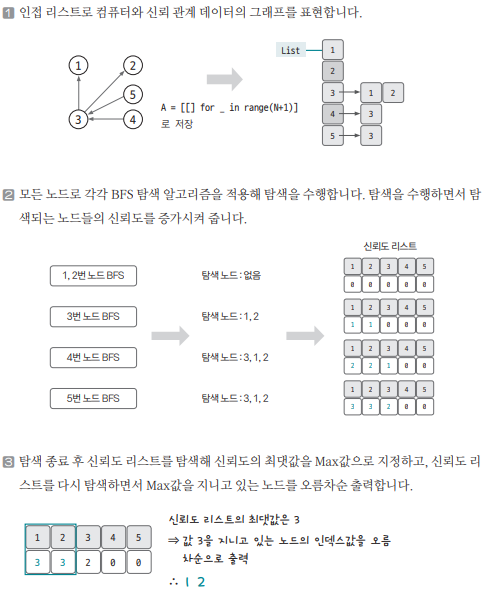

[링크](https://www.acmicpc.net/problem/1325)

## 1. 문제 분석

- N : 컴퓨터 개수 (최대 1만)
- M : 신뢰하는 관계의 개수 (최대 10만)

=> N, M의 크기가 작은 편이라서 시간복잡도와 관련된 제약은 크지 않다.

신뢰 관계 A, B = A가 B를 신뢰한다는 의미  
=> A가 B를 신뢰하는 경우 `B를 해킹`하면 `A도 해킹`할 수 있다.  
=> 바꿔서 말하면 `A를 해킹`했을 때 `B를 해킹할 수 있는 건 아니`다  
=> 때문에 `단방향 그래프`로 표현해줘야겠다

즉, A라는 노드에서 탐색을 진행할 때 B, C를 방문했다고 하면 B, C는 A에게 신뢰받는 노드가 된다.

따라서, 신뢰를 가장 많이 받는 컴퓨터 = 가장 많은 컴퓨터를 해킹할 수 있는 컴퓨터

## 2. 손으로 풀어보기 



## 3. 슈도코드 

``` 
N : 노드 개수
M : 엣지 개수 
A : 그래프 데이터를 저장할 인접 리스트 
answer : 정답 리스트 

BFS : 
    큐 자료구조에 시작 노드 삽입
    visited[현재노드] = True 
    
    while 큐가 비어있을 때까지 : 
        큐에서 노드 데이터를 가져오기 
        if 현재 노드와 이웃한 노드 중 방문해 본 적 없는 노드라면 : 
            visited[이웃 노드] = True 
            신규 노드 index의 정답 리스트값 증가 # 신뢰도 증가 
            큐에 노드 삽입 

for M만큼 반복 : 
    A 인접 리스트에 그래프 데이터 저장 

# 모든 노드를 시작으로 탐색 진행
for i in range(1, N+1) : 
    visited 초기화 
    BFS(i) 실행 

for i in range(1, N+1) : 
    answer 리스트에서 가장 큰 수 찾기 

for i in range(1, N+1) : 
    answer 리스트에서 최댓값을 가진 index를 정답으로 출력 
```

[코드](../../code/day14/47_효율적으로해킹하기.py)