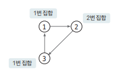
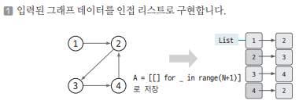
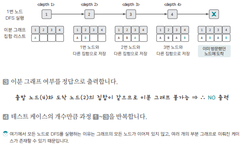

[링크](https://www.acmicpc.net/problem/1707)

## 1. 문제 분석

- 테스트 케이스의 개수 K (최대 5개)
- 각 테스트 케이스의 1번째 줄에 노드의 개수 V (최대 2만개), 엣지의 개수 V (최대 20만개)

이때, 주어진 테스트 케이스의 그래프가  
서로 인접하지 않는 2개의 그래프로 나눌 수 있는지를 판별하는 문제 

---

- `트리`는 항상 이분 그래프가 된다
- `사이클이 발생`하면 이분 그래프가 불가능하다 

ex. 



- `3번 노드`를 1번 집합으로 설정 => 이웃한 1번 노드가 같은 집합에 속함 
- `2번 노드`를 2번 집합으로 설정 => 이웃한 3번 노드는 같은 집합에 속해야 함 

하지만, `3번 노드`는 이미 1번 집합에 속한 노드였다. 따라서, 이분 그래프는 불가능하다

이를 판별하는 방법은 기존 탐색 방법에서 `이미 탐색했던 노드에 다시 접근하게 되었을 때` 현재 노드와 같은 집합에 속한다면 이분 그래프가 불가능하다고 판별할 수 있다. 

## 2. 손으로 풀어보기 



2. 모든 노드에 DFS 알고리즘을 적용해서 탐색을 수행한다.

DFS를 실행할 때 현재 노드와 이웃한 노드 중  
이미 방문한 노드가 현재 노드와 같은 집합이라면 이분 그래프가 아닌 것으로 판별한다. 

실행 결과가 이분 그래프가 아니면 이후 노드는 탐색하지 않는다



## 3. 슈도코드 

``` 
N : 테스트 케이스 개수 
IsBipart : 이분 그래프 판별 변수

DFS : 
    visited 리스트에 현재 노드 방문 기록 
    if 현재 노드와 이웃한 노드 중 방문하지 않은 노드 : 
        현재 노드와 다른 집합으로 연결 노드 집합 저장
        DFS(다음 노드)

    elif 이미 방문한 노드인데, 현재 노드와 같은 집합인 경우 : 
        이분 그래프 아님

for N만큼 반복 : 
    V : 노드 개수 
    E : 엣지 개수
    A : 그래프 데이터 저장 인접 리스트
    visited : 방문 기록 저장 리스트 
    check : 노드별 집합 저장 리스트
    IsBipart = True # 이분 그래프 판별 변수 초기화

    for E만큼 반복 : 
        A 인접 리스트에 그래프 데이터 저장

    for V만큼 반복 : 
        DFS(V) => 결과가 이분 그래프가 아니면 반복 종료. 더 이상의 판별은 진행할 필요가 없다

    이분 그래프 판별 여부 출력
```

[코드](../../code/폴더/파일이름.py)