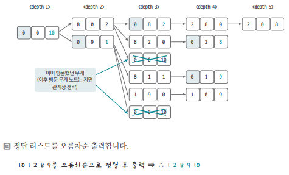

[링크](https://www.acmicpc.net/problem/2251)

## 1. 문제 분석

부피가 A, B, C 리터인 물통 3개가 있다.

처음에는 앞의 두 물통은 비어있고 3번째 물통은 가득(C 리터)차 있다.  

이제 어떤 물통에 들어있는 물을 다른 물통으로 쏟아부을 수 있다.  
이때, 한 물통이 비거나 다른 한 물통이 가득 찰 때까지 물을 부을 수 있다.

이와 같은 과정을 거치다 보면 3번째 물통(용량이 C)에 담길 수 있는 물의 양이 변할 수 있다. 

1번째 물통(용량 A)이 비었을 때 3번째 물통(용량 C)에 담길 수 있는 물의 양을 모두 구하는 프로그램을 작성하자

---

그래프의 원리를 적용해 그래프를 역으로 그리는 방식으로 접근하는 문제 

`A, B, C의 특정 무게 상태`를 `1개의 노드`로 가정하고  
조건에 따라 이 상태에서 변경할 수 있는 `이후 무게 상태`가 `엣지로 이어진 인접한 노드`라고 생각하고 접근한다

## 2. 손으로 풀어보기 

1. 처음에 물통 A, B는 비어있고 C는 꽉 차있으니까 최초 출발 노드를 초기화한다.

(A 용량, B 용량, C 용량) = (0, 0, 3번째 물통의 용량)

예제로 얘기하면 `(0, 0, 10)`

2. BFS를 수행한다.

- 탐색 과정  
    1) 노드에서 할 수 있는 6가지 경우(A->B. A->C, B->A, B->C, C->A, C->B)에 관해 다음 노드로 정해 큐에 추가한다. A, B, C 무게가 동일한 노드에 방문한 이력이 있을 때는 큐에 추가하지 않는다  
    2) `보내는 물통`의 모든 용량을 `받는 물통`에 저장하고 보내는 물통에는 0을 저장한다. 단, 받는 물통이 넘칠 때는 초과하는 값만큼 보내는 물통에 남겨놓는다
    3) 큐에 추가하는 시점에 1번째 물통(A)의 무게가 0일 때가 있으면 3번째 물통(C)의 값을 정답 리스트에 추가한다



## 3. 슈도코드 

``` 
Sender, Receiver : 6가지 경우를 탐색하기 위한 리스트 
now : A, B, C 값 저장
visited : 방문 여부를 저장하는 리스트
answer : 정답 리스트

BFS : 
    큐 자료구조에 출발 노드 추가하기 # A와 B가 0인 상태이므로 (0, 0) 노드에서 시작
    visited 리스트에 현재 노드 방문 기록
    answer 리스트에 현재 C의 값 기록 

    while 큐가 빌 때까지 : 
        큐에서 노드 데이터 가져오기
        데이터를 이용해 A, B, C값 초기화
        for 6가지 케이스 반복 : # A->B. A->C, B->A, B->C, C->A, C->B
            받는 물통에 보내려는 물통의 값 더하기
            보내려는 물통의 값을 0으로 수정
            if 받는 물통이 넘치면
                넘치는 만큼 보내는 물통에 다시 넣고 주고받는 물통은 이 물통의 최댓값으로 저장

            if 현재 노드와 이웃한 노드 중 아직 방문하지 않았다면 
                큐에 데이터 삽입
                visited 리스트에 방문 기록
                if 1번째 물통이 비어있을 때 : 
                    3번째 물통의 물의 양을 answer 리스트에 추가 

BFS 수행

for answer 리스트 탐색 
    answer 리스트에서 값이 true인 index를 정답으로 출력    
```

[코드](../../code/day14/49_물의양구하기.py)