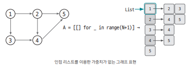

그래프를 구현하는 3가지 방법을 알아본다. 

## 사전 지식 - 2차원 리스트 생성

ex. 0으로 초기화한 행(row) 개수 3, 열(column) 개수 4인 2차원 리스트 생성하기

``` python
A = [[0 for col in range(4)] for row in range(3)] 

# [0 for col in range(4)] : 해당 부분에서 '열' 역할을 하는 리스트 하나 생성
# [~~] for row in range(3) : 앞서 만든 리스트를 3개 만든다.

# 이렇게 되면 자연스럽게 A[2][3] => 2번째 리스트의 3번째 값 = 2행 3열 이 갖춰진다
```

## 엣지 리스트

`엣지 리스트`는 `edge를 중심`으로 그래프를 표현한다.  
`엣지 리스트`는 리스트에 출발 노드, 도착 노드를 저장해서 엣지를 표현한다. 여기에 가중치까지 저장해서 가중치가 있는 엣지도 표현할 수 있다. 

### 가중치 없는 그래프 

`출발 노드`와 `도착 노드`만 표현하므로 리스트에 2개의 열이 필요하다


- 엣지 A → B : [A, B] 로 표현  
- 방향이 없는 그래프라면? [A, B], [B, A]로 표현

이처럼 엣지 리스트로 그래프를 표현할 때, [출발 노드, 도착 노드]를 리스트에 저장하는 방식을 사용한다

### 가중치 없는 그래프 

`가중치`까지 포함하고 싶다면 3개의 열이 필요하다 


- 엣지 A → B, 가중치 W : [A, B, W]로 표현 
- 방향이 없는 그래프라면? [A, B, W], [B, A, W]로 표현


### 장단점 

- 장점   
    1. 구현하기 쉽다
    2. 노드 사이의 최단 거리를 구하는 `벨만-포드 알고리즘`, 최소 신장 트리를 찾는 `크루스칼 알고리즘`에 적합하다

- 단점   
    1. 특정 노드와 관련되어 있는 엣지를 탐색하기 쉽지 않다
    2. 그래서 노드 중심 알고리즘에는 잘 사용하지 않는다

## 인접 행렬

`인접 행렬`은 2차원 리스트를 자료구조로 이용해서 그래프를 표현한다.  
`인접 행렬`은 `노드 중심`으로 그래프를 표현한다

ex. 5개의 노드를 가진 그래프를 인접행렬로 표현 

### 가중치 없는 그래프


- 1 → 2 엣지 : 행렬의 1행 2열에 1을 저장

지금은 가중치가 없는 그래프를 표현하고 싶기 때문에 연결되었다는 의미로 `1`을 저장함 

### 가중치 있는 그래프


- 2 → 5 엣지 : 행렬의 2행 5열에 15를 저장 ==> `가중치 15`를 이와 같이 표현

### 장단점

- 장점   
    1. 두 노드를 연결하는 엣지 여부 & 가중치값을 한 번에 확인할 수 있다

- 단점 
    1. 노드와 관련된 엣지를 탐색하기 위해서 N번 접근해야 해서 시간 복잡도가 인접 리스트에 비해 느리다
    2. 노드 개수에 비해 엣지가 적을 때는 공간 효율성이 떨어진다

## 인접 리스트

말 그대로 `리스트`를 이용해서 그래프를 표현하는 방법


### 가중치 없는 그래프



- 1번 리스트 : 2, 3이 들어있다. <==> 1번 노드와 2, 3번 노드가 연결되어 있다.
- 2번 리스트 : 4, 5가 들어있다. <==> 2번 노드와 4, 5번 노드가 연결되어 있다.

### 가중치 있는 그래프 


- 1번 리스트 : (2, 8), (3, 3)이 들어있다. <==> 1번 노드와 2번 노드가 연결되어 있고 가중치는 8 // 1번 노드와 3번 노드가 연결되어 있고 가중치는 3

- 2번 리스트 : (4, 4), (5, 15)가 들어있다. <==> 2번 노드와 4번 노드가 연결되어 있고 가중치는 4 // 2번 노드와 5번 노드가 연결되어 있고 가중치는 15

### 장단점

- 장점 
    1. 노드와 연결된 엣지를 탐색하는 시간이 뛰어나다
    2. 노드의 개수가 많아도 공간 효율이 좋아 메모리 초과 에러가 발생하지 않는다

==> 이러한 장점 때문에 실제 코딩 테스트에서는 이 방식의 그래프 구현을 선호한다

- 단점   
    1. 그래프를 구현하는 다른 방법에 비해 구현이 복잡하다

