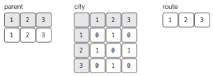
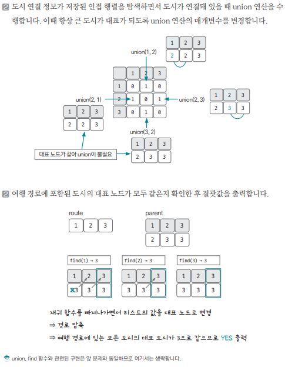

[링크](https://www.acmicpc.net/problem/1976)

## 1. 문제 분석

- 도시 개수 N (도시 사이에 길이 있을지 없을지는 모름)

==> 여행계획이 주어졌을 때 주어진 계획대로 여행할 수 있는지를 파악하려고 한다

1번째 줄 : 도시의 수 N
2번째 줄 : 여행 계획에 속한 도시들의 개수 M (최대 1000)
~
N개의 줄 : N개의 정수가 주어진다. 도시들간의 연결 상황을 인접 행렬로 제공한다. (1이면 연결, 0이면 연결 안 됨)
~

마지막 줄 : 여행 계획 (도시 번호는 1~N까지 차례대로 매겨져있다)

---

`도시의 연결 유무`를 `Union-Find 연산`을 이용해 해결할 수 있다는 아이디어를 떠올릴 수 있으면 쉽게 해결할 수 있다.

이 문제에서는 `도시 간의 연결 데이터`를 `인접 행렬`로 제공했다.  
때문에 인접 행렬을 탐색하면서 연결 지점이 있을 때마다 union 연산을 수행하는 방식으로 접근하면 된다. 

## 2. 손으로 풀어보기 

- parent : 대표 노드 리스트
- city : 도시 데이터
- route : 여행 경로 데이터 





## 3. 슈도코드 

``` 
N : 도시의 수 
M : 여행 계획에 속한 도시의 수 
city : 도시 연결 데이터 리스트 

find(a) : 
    a가 대표 노드면 return
    
    그렇지 않다면 a의 대표 노드값을 find(parent[a])로 저장 

union(a, b) : 
    a와 b의 대표 노드 찾기
    두 원소의 대표 노드끼리 연결 

for i in range(1, N+1) : 
    city 데이터 저장 

parent : 대표 노드를 저장할 리스트 

for N만큼 반복 : 
    대표 노드를 자기 자신으로 초기화 

for i => N만큼 반복 : 
    for j => N만큼 반복 : 
        city[i][j] == 1(두 도시가 연결되어 있으면 => union 연산 진행 

isConnect(연결 여부 저장하는 변수)

for 2~M만큼 반복 : 
    route에 포함되는 노드들의 대표 노드가 모두 동일한 지 확인 후 isConnect 값 설정 

isConnect에 따라 YES, NO 출력
```

[코드](../../code/폴더/파일이름.py)