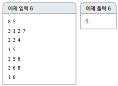
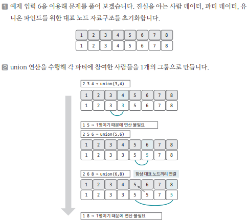
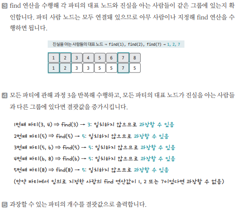

[링크](https://www.acmicpc.net/problem/1043)

## 1. 문제 분석

- 1번째 줄 : 사람 수 N , 파티 수 M 
- 2번째 줄 : 지민이의 진실을 아는 사람과 그 개수만큼 번호가 주어진다.

지민이는 모든 파티에 참가해야 하는데... 이때, 지민이의 거짓말이 들통나지 않을 수 있는 파티의 개수의 최댓값을 구하시오

즉, 지민이의 진실을 아는 사람이 속한 파티의 개수는 최소값이여야 한다

---

핵심 : 파티에 참석한 사람들을 1개의 집합으로 생각하고 각각의 파티마다 union 연산을 이용해 사람들을 연결하는 것이다

==> 이 작업을 하면 하나의 파티에 있는 모든 사람들은 같은 대표 노드를 바라보게 된다. 

이후 `각 파티의 대표 노드`와 `진실을 알고 있는 사람들의 각 대표노드`가 동일한지 find 연산을 이용해 확인하면 된다

## 2. 손으로 풀어보기 

- 예제 6번 상황



1) 사람 수 8명 / 파티 수 5개  
2) 진실을 아는 사람 3명 / 1,2,7번 사람이 진실을 알고 있다
3) 3번째 줄 부터는 앞서 제시된 5개의 파티의 정보가 주어진다. `파티에 오는 사람 수`와 `파티에 오는 사람의 번호`가 주어진다





## 3. 슈도코드 

``` 
N : 사람 수
M : 파티 개수 
true_people : 진실을 아는 사람 데이터 
T : 진실을 아는 사람 수 
party : 파티 데이터 

find(a) : 
    a가 대표 노드면 return 

    a가 대표 노드가 아니면 a의 대표 노드값을 find(parent[a])로 저장 

union(a, b) : 
   a, b의 대표노드 찾기
   두 원소의 대표노드끼리 연결 

checkSame(a, b) : 

    a, b의 대표노드 찾기 
    대표노드가 서로 같으면 true 
    아니면 false

파티 데이터 저장 

for N만큼 반복 : 
    대표 노드를 자기 자신으로 초기화

for M만큼 반복 : 
    firstPerson : i번째 파티의 1번째 사람 

    for j in i번째 파티의 사람 수 : 
        union(firstPerson, j) # 각 파티에 참여한 사람들을 하나의 그룹으로 만들기 

for M만큼 반복 : 

    firstPerson : i번째 파티의 사람 

    for j -> 진실을 아는 사람들의 수만큼 반복 : 

        # 각 파티의 대표노드와 
        # 진실을 아는 사람들의 대표노드가 동일하면 
        # 거짓말을 할 수 없다 
        find(firstPerson), find(true_people[j]) 비교 

    모두 다르면 결과값 1 증가

결과값 출력
```

[코드](../../code/day15/52_거짓말쟁이싫어.py)