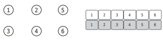
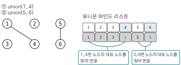
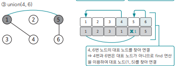
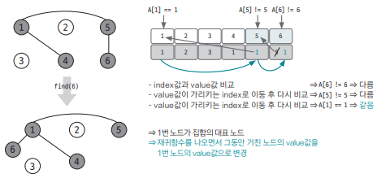
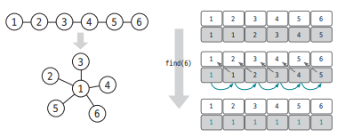

## 핵심 이론

`Union-Find`는 말 그대로 `Union 연산`과 `Find 연산`으로 구성된 알고리즘이다.  

2개의 연산이 어떤 것인지를 명확히 이해해야 한다.

- union 연산 : 각 노드가 속한 `집합을 하나로 합치는` 연산. 노드 a, b가 a ∈ A, b ∈ B일 때 union(A, B)는 A∪B를 의미한다.

- find 연산 : 노드 a에 대해 `a가 속한 집합의 대표 노드를 반환`하는 연산. 노드 a가 a ∈ A일 때 find(a)는 A 집합의 대표 노드를 반환한다

## 알고리즘 구현 방법

### 1. Union-Find를 표현하는 일반적인 방법 ⇒ `1차원 리스트`

그 리스트에 각 노드의 대표 노드값을 저장한다.  
초기에는 노드가 서로 연결되어 있지 않기 때문에 각 노드의 대표 노드는 자기 자신이다. 

아래 그림
- 왼쪽 : 초기에 노드만 주어지고 아무런 연결이 없는 상태를 나타낸 그림
- 오른쪽 : 왼쪽의 상태를 1차원 리스트로 표현한 그림 

### 2. Union 연산 

`union 연산`은 앞서 `각 노드가 속한 집합을 하나로 합치는` 연산이라고 했다.  
즉, `2개의 노드가 속한 집합을 합친다`는 건 `각 노드가 속한 집합의 대표 노드를 찾아서 연결한다`는 것과 동일하다 

ex. 1, 4와 5, 6을 union 연산으로 연결하고 싶다

이를 위해서는 다음과 같은 과정이 필요하다.

1. 1과 4를 연결(union) & 5와 6을 연결(union)

- 1과 4를 연결(union)  
⇒ 1을 대표 노드로 4를 자식 노드로 union 연산을 하기 때문에  
⇒ `리스트[4] = 1`로 업데이트

- 5와 6을 연결(union)  
⇒ 5를 대표 노드로 6을 자식 노드로 union 연산을 하기 때문에  
⇒ `리스트[6] = 5`로 업데이트

2. (1, 4)와 (5, 6)을 연결(union)

이 동작을 수행하기 위해서 `union(4, 6)` 연산을 실행했다고 하자 

4, 6은 대표노드가 아니다.  
그래서 각 노드의 대표 노드를 찾고 ⇒ 그렇게 찾은 대표노드를 서로 연결한다.

`4의 대표노드는 1` / `6의 대표노드는 5` 이니까 1과 5을 서로 연결한다. 

지금은 `4의 대표노드 1`에 `6의 대표노드 5`를 `연결`했다. 그래서 `리스트[5] = 1`로 업데이트되었다.

### 3. find 연산 

`find 연산` : 자신이 속한 집합의 대표 노드를 찾는 연산

뿐만 아니라 그래프를 정리하고 시간 복잡도를 줄인다

#### 작동원리 

1. 대상 노드 리스트의 index값 과 value값이 동일한지 확인   
2. `동일하지 않다면` value값이 가리키는 index 위치로 이동  
3. 이동한 위치의 index값과 value값이 같을 때 까지 1~2 과정을 반복한다. 이때, 반복은 `재귀함수`를 이용하면 된다.  
4. 대표 노드에 도달하면 재귀함수를 빠져나오면서 거치는 모든 노드값을 대표 노드값으로 변경한다.

ex) 

- 원래 상황 

`find(6)`을 실행함 

1) index값과 value값 비교 ⇒ A[6] = 5, index = 6 서로 다르다. ⇒ 2번 과정 수행 
2) value값이 가리키는 index로 이동 후 다시 비교 ⇒ A[5] = 1, index = 5 서로 다르다. ⇒ 반복
3) value값이 가리키는 index로 이동 후 다시 비교 ⇒ A[1] = 1, index = 1 서로 같다. 따라서 `6번 노드가 속한 집합`의 `대표노드는 1`이다. 

4) 재귀함수에서 나오면서 그동안 거쳐왔던 노드의 value값을 A[1] = 1로 변경한다

- 결과 

#### 그래프가 정리되면서 시간 복잡도가 줄어드는 이유

연산을 할 때 거쳐온 노드들이 대표 노드와 바로 연결되는 형태로 변경되기 때문이다. 이렇게 되면 이후에 노드와 관련된 find 연산의 속도는 O(1)로 변경된다.

`find 연산`을 통해 모든 노드가 루트 노드에 직접 연결되는 형태로 변경된 걸 확인할 수 있다. 

ex) 한 번 find 연산을 수행하고 나서 `find(4)`를 수행한다면? 단 1번의 이동으로 대표 노드를 찾을 수 있게 된다.

