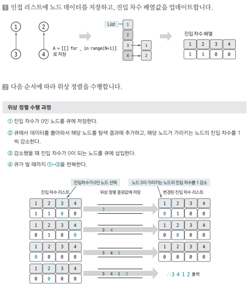

[링크](https://www.acmicpc.net/problem/2252)

## 1. 문제 분석

N명의 학생들을 키 순서대로 줄 세우려고 한다.  
여기서 사용하려는 방법은 두 학생의 키를 비교하는 방법이다 

일부 학생들의 키를 비교한 결과가 주어졌을 때 줄을 세우는 프로그램을 작성하시오

- 1번째 줄 : 학생수 N, 키를 비교한 횟수 M 
- 이후 M개의 줄 : 키를 비교한 두 학생의 번호 A, B => 학생 A가 학생 B의 앞에 서야 한다는 뜻 

출력의 전제 : 답이 여러 가지일 경우 아무거나 출력한다 ==> 이는 `위상 정렬의 결과값`이 `일정하지 않다`는 알고리즘의 전제와 동일하다

---

학생들 => 노드 / 키 순서 비교 데이터 => 엣지 로 만든다고 생각했을 때 노드들의 순서를 도출하는 가장 기본적인 문제 


## 2. 손으로 풀어보기 



## 3. 슈도코드 

``` 
N : 학생 수, M : 비교 횟수 
A : 비교 데이터를 저장하는 인접 리스트 

indegree : 진입 차수 리스트 

for M만큼 반복 : 
    인접 리스트 데이터 저장
    진입 차수 리스트 초기 데이터 저장 

큐 생성 # 이걸 가지고 위상 정렬을 수행

for N만큼 반복 : 
    진입 차수 리스트 값이 0인 학생(노드)을 큐에 삽입

while 큐가 빌 때까지 : 
    현재 노드 = 큐에서 데이터 가져오기 
    현재 노드값 출력 

    for 현재 노드에 이웃한 노드의 개수 : 

        타킷 노드의 진입 차수 리스트 값을 1 감소
        if 타킷 노드의 진입 차수 == 0 : 
            큐에 타킷 노드 추가 
```

[코드](../../code/day16/53_줄세우기.py)