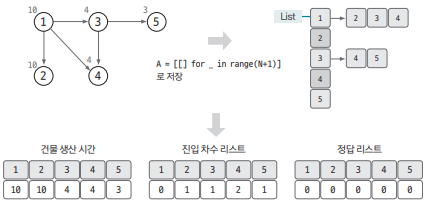
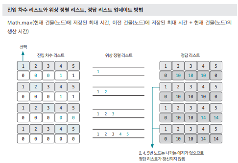
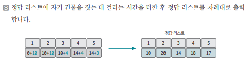

[링크](https://www.acmicpc.net/problem/1516)

## 1. 문제 분석

N개의 건물을 지을 때 각 건물을 짓기 위해 필요한 최소 시간을 출력할 것 

1번째 줄 : 건물의 종류 수 
2번째 줄 이후 : 각 건물을 짓는데 걸리는 시간, 해당 건물을 짓기 위해 먼저 지어야 하는 건물들의 번호

ex) 
```
5
10 -1 => 1번째 건물을 짓는데 10만큼 소요 
10 1 -1 => 2번째 건물을 짓는데 10만큼 소요, 1번째 건물이 먼저 지어져야 함
4 1 -1 => 3번째 건물을 짓는데 4만큼 소요, 1번째 건물이 먼저 지어져야 함
4 3 1 -1 => 4번째 건물을 짓는데 4만큼 소요, 1 & 3번째 건물이 먼저 지어져야 함
3 3 -1 => 5번째 건물을 짓는데 3만큼 소요, 3번째 건물이 먼저 지어져야 함
```

---

문제를 해결하기 위해서 `어떤 건물을 짓기 위해 먼저 지어야 하는 건물이 있을 수 있다`라는 문장에 주목해야 한다 

즉, 건물을 `노드`라고 생각하면 그래프 형태에서 노드 순서를 정렬하는 알고리즘인 `위상 정렬`을 사용하는 문제라는 걸 파악할 수 있다. 

건물 수는 최대 500, 시간 복잡도 2초라서 시간 제한 부담은 없다

## 2. 손으로 풀어보기 

1. 입력 데이터를 바탕으로 필요한 자료구조 초기화 

- 전체 그래프 : 인접 리스트로 표현
- 각 건물의 생산 시간은 리스트로 저장
- 진입 차수 리스트 
- 정답 리스트 



2. 위상 정렬을 실행하면서 각 건물을 짓는데 걸리는 최대 시간을 업데이트한다.  
업데이트 방법은 아래와 같다

- 진입 차수가 0인 `1번 노드`부터 시작 
- 1번 노드와 이웃한 `2번 노드`를 예시로 들겠다.
- Math.max(`2번 노드에 저장된 최대 시간`, `1번 노드에 저장된 최대 시간` + `1번 노드의 생산 시간`)을 가지고 `2번 노드에 저장된 최대 시간을 업데이트`한다






## 3. 슈도코드 

``` 
N : 건물 수
A : 건물 데이터를 저장하는 인접 리스트 

indegree : 진입 차수 리스트 

selfBuild : 자기 자신을 짓는데 걸리는 시간 저장 리스트 

for 건물 개수 : 

    인접 리스트 데이터 저장
    진입 차수 리스트 데이터 저장
    자기 자신을 짓는데 걸리는 시간 리스트 데이터 저장

# 위상 정렬을 수행함
큐 생성 

for N만큼 반복 : 
    진입 차수 리스트의 값이 0인 건물(노드)을 큐에 삽입

while 큐가 빌 때까지 : 
    현재 노드 <= 큐에서 데이터 pop

    for 현재 노드에 이웃한 노드 탐색 : 

        타깃 노드 진입 차수 리스트 1 감소 
        결과 노드 업데이트 = max(현재 저장된 값, 현재 출발 노드 + 비용)

        if 타킷 노드의 진입 차수 == 0 : 
            우선순위 큐에 타킷 노드 추가 

위상 정렬 결과 출력 
```

[코드](../../code/폴더/파일이름.py)