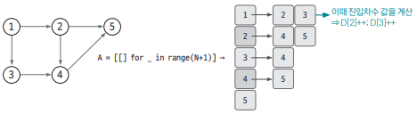
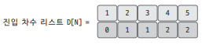
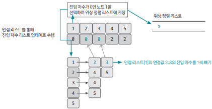
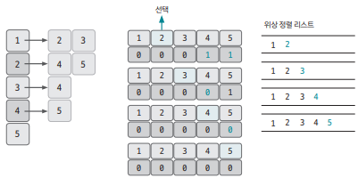
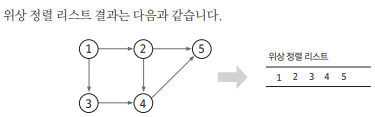

## 개요 

위상 정렬(topology sort) : `사이클이 없는 방향 그래프`에서 노드 순서를 찾는 알고리즘 

- 시간 복잡도 : O(노드 개수 + 엣지 개수)
- 유의할 점
    1) 항상 유일한 값으로 정렬되지 않는다  
    2) 사이클이 존재하면 노드 간의 순서를 명확하게 정의할 수 없어서 위상 정렬을 적용할 수 없다

## 핵심 이론

### 1. 진입 차수 리스트 초기 설정

`진입 차수` : 자기 자신을 가리키는 엣지의 개수 

아래 그림은 사이클이 없는 그래프이다. 

진입 차수 리스트를 D라고 하자.

- 1번째 노드 : 2번째, 3번째 노드를 가리킨다 ⇒ D[2]++, D[3]++
- 2번째 노드 : 4번째, 5번째 노드를 가리킨다 ⇒ D[4]++, D[5]++

이런식으로 진입 차수 리스트를 관리할 때 아래와 같이 리스트를 만들 수 있다. 

### 2. 만들어낸 진입 차수 리스트로 위상 정렬

1) `진입 차수가 0인 노드`를 선택
2) 선택된 노드를 정렬 리스트에 저장 
3) 그래프를 구현한 인접 리스트에서 선택된 노드와 이웃한 노드들의 진입 차수를 1씩 뺀다

ex. 진입 차수가 0인 노드 `1`을 선택한 상황 

1) `진입 차수가 0인 노드`를 선택 ==> `노드 1 선택`
2) 선택된 `노드 1`을 정렬 리스트에 저장
3) 그래프를 구현한 인접 리스트에서 선택된 `노드 1과 이웃한 노드들`의 `진입 차수를 1씩 뺀다`

이 과정을 모든 노드에 대해 반복한다 

아래 상황은 1과 이웃한 노드 중 `2를 먼저 선택한 상황`이다. 
만약 3을 먼저 선택했다면 위상 정렬의 순서가 달라졌을 것이다. 

