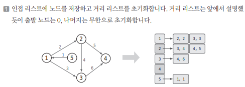
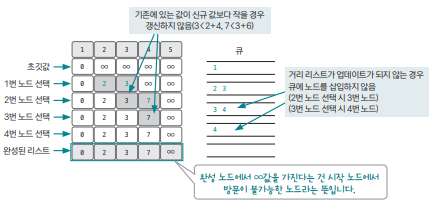

[링크](https://www.acmicpc.net/problem/1753)

## 1. 문제 분석

엣지의 가중치가 10 이하인 자연수인 `방향 그래프`가 있다.  
이 그래프의 시작점에서 다른 모든 노드로의 최단 경로를 구하자

- 1번째 줄 : V(노드의 개수, 최대 2만) E(엣지의 개수, 최대 30만) 
- 2번째 줄 : K(출발 노드 번호)
- 3번째 줄 이후 : (u, v, w) = u → v 방향의 엣지가 있고 가중치는 w이다

---

시작점에서 나머지 노드로의 최단 경로를 구하는 문제이기 때문에 `다익스트라 알고리즘`의 가장 기본적인 형태를 구현해야 하는 문제다. 

## 2. 손으로 풀어보기 



2. 시작점을 우선순위 큐에 삽입 => 그 이후에 다익스트라 알고리즘 수행 

- 다익스트라 알고리즘  
    1) 우선순위 큐에서 데이터를 pop한다. (아직 방문하지 않은 노드 중 현재 값이 가장 작은 노드를 선택하는 과정)
    2) 1번 과정에서 뽑은 노드(현재 노드)와 이웃한 노드들의 최단 거리를 구해서 업데이트한다.
     - Min(현재 노드의 거리 리스트 값, 이웃노드의 거리 리스트 값 + 엣지 가중치)로 업데이트
     - 업데이트가 수행되는 경우 이웃한 노드를 우선순위에 삽입
    3) 큐가 빌 때까지 1~2번 과정 반복 



3. 완성된 거리 리스트 값 출력 

## 3. 슈도코드 

``` 
V : 노드 개수, E : 엣지 개수 
K : 출발 노드 

distance : 최단 거리 저장 리스트 
visited : 방문 여부를 저장하는 리스트
myList : 엣지 데이터를 저장할 인접리스트

q : 다익스트라를 위한 우선순위 큐 

for 엣지 개수만큼 반복 : 
    인접 리스트에 엣지 정보 저장 

# 다익스트라 수행 
출발 노드를 우선순위 큐에 넣고 시작 
거리 리스트에 출발 노드의 값을 0으로 설정

while 큐가 빌 때까지 : 
    현재 노드 = 우선순위 큐.pop

    # 현재 노드에 방문한 적이 있는지 확인 
    if visited[현재노드] : 
        continue 
    
    visited[현재 노드] = True # 현재 노드에 방문했다는 걸 표시 

    for 현재 노드와 이웃한 노드 개수만큼 반복 : 

        if not visited[이웃한 노드] and distance[현재 노드] + 가중치 < distance[이웃 노드] : 
            
            # 이웃한 노드의 최단 거리 업데이트
            distance[이웃 노드] = distance[현재 노드] + 가중치 

            q.enqueue(이웃 노드) # 우선순위 큐에 연결 노드 추가

완성된 distance를 출력 
```

[코드](../../code/day17/56_최단경로구하기.py)