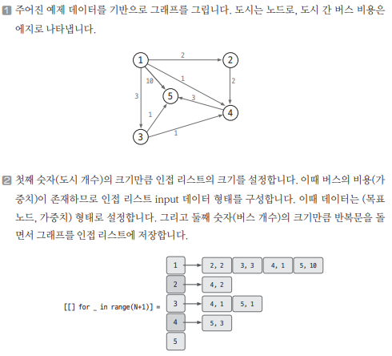
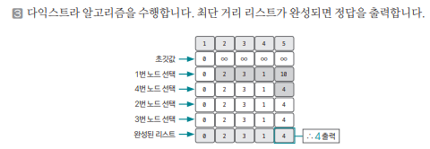

[링크](https://www.acmicpc.net/problem/1916)

## 1. 문제 분석

도시 개수 N, 버스 개수 M

하나의 도시에서 다른 도시로 이동하는데 드는 비용을 최소화하려고 한다.

이때, A번째 도시 -> B번째 도시까지 가는데 드는 최소 비용을 출력하라

- 1번째 줄 : 도시 개수 N (최대 1천)
- 2번째 줄 : 버스 개수 M (최대 10만)
- 3번째 줄 ~ M+2번째 줄 : `출발 도시 번호, 도착 도시 번호, 비용` 형식으로 데이터가 주어진다 (단, 비용은 항상 양수다)
- 맨 마지막 줄 : 출발점 도시 번호, 도착점 도시 번호

--- 

표현만 달리했을 뿐 주어진 `시작점`에서 `도착점`까지 가는 최단 거리를 구하는 문제이다. 또한 버스 비용(가중치)은 양수이기 때문에 `다익스트라 알고리즘`을 이용해 해결할 수 있다.

## 2. 손으로 풀어보기 





## 3. 슈도코드 

``` 
N : 노드 개수, M : 엣지 개수
myList : 엣지 데이터를 저장하는 인접 리스트

distance : 최단 거리를 저장하는 리스트 

visited : 방문 여부를 저장하는 리스트

for 엣지 개수만큼 반복 : 
    인접 리스트에 엣지 정보를 저장

start_index, end_index 데이터 받기 

# 다익스트라 함수 구현
def 다익스트라 함수 : 
    출발 노드를 우선순위 큐에 넣고 시작 # 우선순위 큐를 사용해서
                                    # 거리가 최소인 노드를 맨 앞에 놓도록 했다
                                    # 이를 위해서는 (distance[해당 노드], 해당 노드 번호) 형식으로 우선순위 큐에 데이터를 추가해줘야 한다

    while 큐가 빌 때까지 : 
        현재 노드 = 우선순위 큐.pop

        # 현재 노드를 방문한 적이 있는지 확인
        if visited[현재 노드] : 
            continue

        visited[현재 노드] = True # 현재 노드를 방문한 걸로 업데이트

        for 현재 노드와 이웃한 노드만큼 반복 : 

            if 아직 이웃 노드를 방문하지 않았고 distance[이웃 노드] > distance[현재 노드] + (현재 노드 ~ 이웃 노드의 가중치) : 
                distance[이웃 노드] = distance[현재 노드] + (현재 노드 ~ 이웃 노드의 가중치)

                우선순위 큐.enqueue((distance[이웃 노드], 이웃 노드))

    return 종료 인덱스의 최종 거리 

다익스트라 수행 후 결과값 출력
    
```

[코드](../../code/day17/57_최소비용구하기.py)