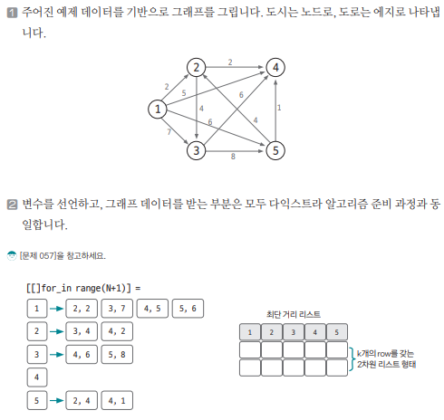
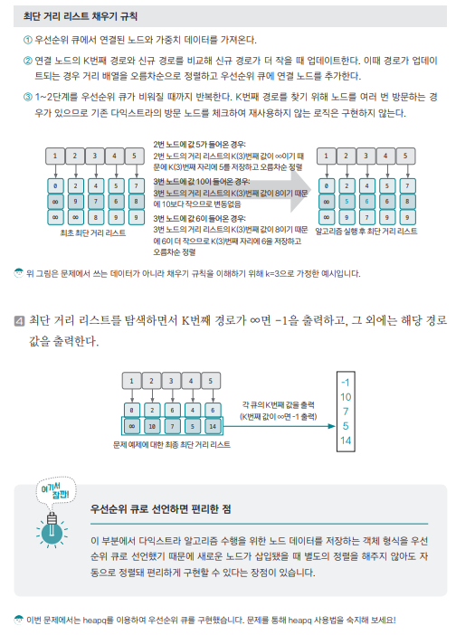

[링크](https://www.acmicpc.net/problem/1854)

## 1. 문제 분석

최단 거리 말고 `K번째 최단 거리`를 구하고 싶다

- 1번째 줄 : n, m, k = 도시 개수, 도시 간에 존재하는 도로 개수, k번째 최단 경로의 k
- 2번째 줄 이후 m개의 줄 : a, b, c = a번 도시 -> b번 도시로 갈 때 c의 시간 소요

도시 번호는 1~n까지 연속해 있고 1번은 시작 도시

--- 

`시작점`과 `도착점`이 주어지고 목적지까지 가는 `K번째 최단 경로`를 구하는 문제

노드의 최대 개수 1천, 엣지의 최대 개수 200만, 시간 제약 2초이므로 `다익스트라 알고리즘`으로 접근해보자.

### K번째 최단경로 해결방법

- 최단 경로를 표현하는 리스트 : K개의 row를 갖는 2차원 리스트 형태로 변경. 이를 통해 최단 경로 ~ K번째 최단 경로까지 표현할 수 있다

- K번째 경로를 찾기 위해 하나의 노드를 여러 번 방문해야 하기 때문에 기존에 방문했던 노드를 다시 방문하지 않는 부분은 삭제해줘야겠다.

## 2. 손으로 풀어보기 



- 앞서 말한 것 처럼 `최단 거리 리스트`를 `K개의 row를 갖는 2차원 리스트`로 선언했다. 초기화는 최초 시작 노드는 0, 나머지는 모두 아주 큰 수로 초기화한다

3. 아래 규칙을 토대로 최단 거리 리스트에 값을 채운다



## 3. 슈도코드 

``` 
N : 노드 개수
M : 엣지 개수
K : K번째 최단 경로의 K

W : 그래프 정보를 저장할 인접 리스트
distance : 최단 거리 리스트

for 엣지 개수만큼 : 
    인접 리스트에 엣지 정보를 저장

우선순위 큐에 시작 노드 저장 # 1번 노드, 거리 0 
시작 도시 최단 거리 저장     # 시작점이라서 0으로 저장한다

# 다익스트라 수행
while 큐가 빌 때까지 : 

    현재 노드 = 우선순위 큐.pop # (거리, 노드) 형식

    for 현재 노드와 이웃한 엣지 탐색 : 

        새로운 총 거리 = distance[현재 노드] + 엣지 가중치 

        if 새로운 노드의 K번째 최단 거리 > 새로운 총 거리 : 
            (새로운 노드의 K번째 최단 거리 <= 새로운 총 거리로 업데이트) & (거리 순 정렬)

            우선순위 큐에 새로운 데이터 추가 # (거리, 노드) 형식

for 노드 개수 : 

    if 각 노드의 거리 리스트에 K번째 값이 최초 설정 값 : 
        -1 출력 

    else : 
        K번째 값 출력 
```

[코드](../../code/day17/58_K번째최단경로찾기.py)