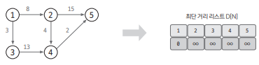

## 개요 

`다익스트라(dijkstra)` 알고리즘 : 그래프에서 최단 거리를 구하는 알고리즘 

단, 그래프의 모든 엣지는 `양수`여야 한다.

시간복잡도 : O(ElogV) - V : 노드 개수, E : 엣지 개수

## 핵심이론 

### 1. 인접 리스트로 그래프 구현하기 

- 인접 리스트로 구현하는 이유 : 시간 복잡도 측면에서 노드의 개수가 큰 경우 인접 행렬 보다는 `인접 리스트`가 좀 더 유리하다 

- 1번 노드와 이웃한 노드를 저장하는 방법 : (2번 노드, 가중치 8), (3번 노드, 가중치 3) 이런 형식으로 데이터가 저장된 걸 확인할 수 있다

### 2. 최단 거리 리스트 초기화 

1) `최단 거리 리스트`를 만들고 
2) `출발 노드`는 `0`으로 초기화
3) `나머지 노드`는 `아주 큰 수`로 초기화

### 3. 값이 가장 작은 노드 선택 

2번에서 만든 `최단 거리 리스트`에서 `현재 값이 가장 작은 노드`를 고른다.  
여기서는 값이 0인 출발 노드에서 시작하면 되겠다.

### 4. 최단 거리 리스트 업데이트

선택한 노드와 이웃한 엣지 값을 바탕으로 다른 노드의 값을 업데이트한다.  
이 과정에서 노드를 선택할 때 마다 재방문하지 않도록 방문 리스트를 만들어서 처리한다.

아래 그림은 앞서 1번 노드를 선택했으니 이웃한 노드 2, 3번 노드의 값을 업데이트하는 상황이다.

1) 1번 노드가 선택된 상황
2) 2번 노드의 값 업데이트 = Min(1번 노드의 현재 값 (0) + 1-2번 엣지의 가중치 8, 2번 노드의 현재 값(아주 큰 값)) = Min(8, 아주 큰 값) = 8
3) 3번 노드의 값 업데이트 = Min(1번 노드의 현재 값 (0) + 1-3번 엣지의 가중치 3, 3번 노드의 현재 값(아주 큰 값)) = Min(3, 아주 큰 값) = 3

### 5. 과정 3~4를 반복해 최단 거리 리스트 완성 

모든 노드가 선택될 때까지 반복하면 최단 거리 리스트가 만들어진다.

## 정리 

다익스트라 알고리즘 : `출발 노드`와 `나머지 노드`간의 최단 거리를 구하는 알고리즘 (단, 모든 엣지의 가중치는 양수)