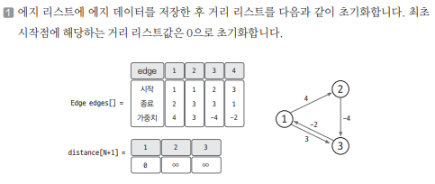
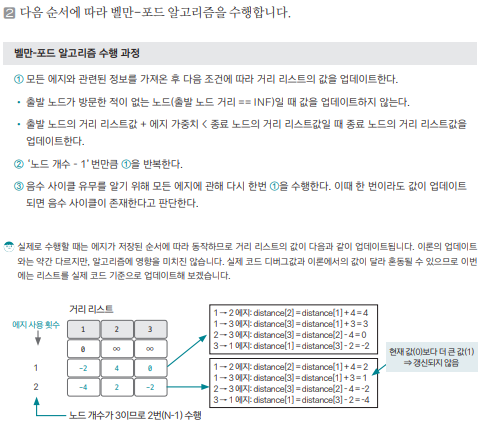
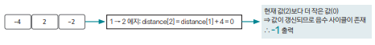

[링크](https://www.acmicpc.net/problem/11657)

## 1. 문제 분석

- N개의 도시 = N개의 노드   
- M개의 버스 = M개의 엣지 

각 버스를 A, B, C로 표현 = (시작 도시, 도착 도시, 가중치)

시간 C는 양수일 수도 있고 아닐 수도 있다.

- C = 0 : 순간이동하는 경우
- C < 0 : 타임머신으로 시간을 되돌아가는 경우 

1번 도시에서 출발해 나머지 도시로 가는 가장 빠른 시간을 구하는 프로그램을 작성하자

---

시작점에서 다른 노드에 도달하는 최단 거리를 구하는 문제이다.  
다만, 엣지의 가중치값이 `음수`가 될 수 있다는 점이 특징이다.

때문에 `벨만-포드 알고리즘`을 사용해야 한다.

## 2. 손으로 풀어보기 





3. 최종적으로 구한 최단 거리 리스트를 다시 한 번 갱신해서 음수 사이클이 존재하는지 판단한다



## 3. 슈도코드 

``` 
N : 노드 개수
M : 엣지 개수

edges : 엣지 정보를 저장하는 리스트 

distance : 거리 리스트 # 충분히 큰 수로 초기화

for 엣지 개수만큼 반복 : 
    엣지 리스트에 엣지 정보를 저장

# 벨만포트 알고리즘 수행

distance[출발 노드] = 0 # 거리 리스트의 출발 노드 0으로 초기화

for N-1만큼 반복 : 
    for 엣지 개수만큼 반복 : 

        현재 엣지 데이터 가져오기 # 현재 엣지[0] : 출발 노드
                                  # 현재 엣지[1] : 도착 노드
                                  # 현재 엣지[2] : 가중치   
        if 출발 노드 != 무한대 and distance[출발 노드] + 가중치 < distance[종료 노드] : 
            distance[종료 노드] <= distance[출발 노드] + 가중치 업데이트

# 음수 사이클이 존재하는지 확인 
for 엣지 개수만큼 반복 : 
    현재 엣지 데이터 가져오기 # 현재 엣지[0] : 출발 노드
                                  # 현재 엣지[1] : 도착 노드
                                  # 현재 엣지[2] : 가중치   
        if 출발 노드 != 무한대 and distance[출발 노드] + 가중치 < distance[종료 노드] : 
            업데이트가 가능한 상황이 생겼다. 따라서 음수 사이클이 존재한다
    
음수 사이클이 존재하지 않으면 거리 리스트 출력
음수 사이클이 존재하면 -1 출력
```

[코드](../../code/day18/59_타임머신으로빨리가기.py)