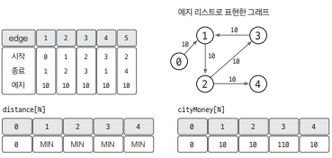
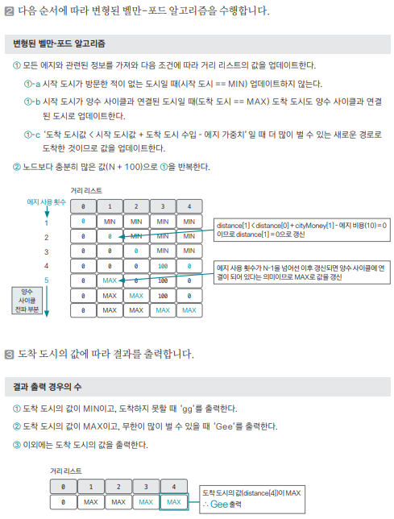

[링크](https://www.acmicpc.net/problem/1219)

## 1. 문제 분석

A 도시에서 시작해서 B 도시에서 끝나는 출장으로 최대한 많은 돈을 벌고 싶다.


- 1번째 줄: 도시의 수(N), 시작 도시, 도착 도시, 교통 수단 개수(M) 순으로 데이터가 주어짐  
- 2번째 줄 이후 : 교통 수단의 정보가 주어짐. (시작 도시, 도착 도시, 가격) 형식으로 주어진다.
- 마지막 줄 : 각 도시에서 벌 수 있는 돈의 최대값이 0번 도시부터 차례대로 주어짐

```
3 0 2 3 # 도시의 수 3개, 시작 도시 0번, 도착 도시 2번, 교통수단 3개 
0 1 10  # 교통 수단 : 이동 경로 0 -> 1, 가격 10
1 0 10  # 교통 수단 : 이동 경로 1 -> 0, 가격 10 
2 1 10  # 교통 수단 : 이동 경로 2 -> 1, 가격 10 
1000 1000 47000 # 0번 도시에서 최대 1000 벌 수 있음
                # 1번 도시에서 최대 1000 벌 수 있음
                # 2번 도시에서 최대 47000 벌 수 있음
```

도착 도시에 도착할 때 지니고 있는 돈의 액수의 최댓값을 출력할 것 

- 만약 도착 도시에 도착할 수 없다면 `gg`를 출력한다.
- 도착도시에 도착했을 때 돈을 무한히 많이 가질 수 있다면 `Gee`를 출력한다

---

`벨만-포드 알고리즘`을 바탕으로 요구사항에 따라 내부 로직을 바꿔야 한다.  
==> 도착 도시에 왔을 때 돈의 액수가 최대가 되도록 업데이트 방식을 변경해야 한다  
==> 돈을 무한히 많이 버는 케이스도 있을 수 있기 때문에 `양수 사이클`을 찾도록 변경해줘야 한다

여기서 `양수 사이클`이 있다고 하더라도 출발 노드에서 목적지 노드로 도착하지 못하는 경우가 있을 수 있기에 이에 대한 예외처리가 필요하다

==> 이를 해결하기 위해 엣지의 업데이트 횟수를 도시 개수의 최대값(100)만큼 실행한다.  
==> 이렇게 하면 엣지를 충분히 탐색하면서 양수 사이클에서 도달할 수 있는 모든 노드를 양수 사이클에 연결된 노드로 업데이트할 수 있다

## 2. 손으로 풀어보기 





## 3. 슈도코드 

``` 
N : 노드 개수
M : 엣지 개수 
start_city : 시작 도시, end_city : 종료 도시 

edges : 엣지 리스트 
distance : 거리 리스트

for 엣지 개수만큼 반복 : 
    엣지 리스트에 엣지 정보를 저장 

cityMoney : 각 도시에서 버는 수입 저장 

# 변형된 벨만-포드 수행
거리 리스트에 출발 노드 cityMoney[출발 노드]로 초기화

for 노드 개수 + 100만큼 반복 # 양수 사이클이 전파되도록 충분히 큰 수로 반복 
    for 엣지 개수만큼 반복 : 
        현재 엣지 데이터 가져오기 

        if 출발 노드가 방문하지 않은 노드라면 : 
            skip
        elif 출발 노드가 양수 사이클에 연결된 노드 : 
            종료 노드를 양수 사이클에 연결된 노드로 업데이트 
        elif 종료 노드의 값 < 출발 노드의 값 + 도착 도시에서의 수입 - 엣지의 가중치 : 

            종료 노드의 값 <= 출발 노드의 값 + 도착 도시에서의 수입 - 엣지의 가중치로 업데이트 
            if 노드 개수 - 1 반복 이후 업데이트 : 
                종료 노드를 양수 사이클 연결 노드로 업데이트 

# 도착 도시의 값에 따른 결과 출력 
도착 도시가 초기값(-sys.maxsize) 라면 도착 불가 => 'gg' 출력 

도착 도시가 양수 사이클(sys.maxsize)이라면 돈을 무한히 벌 수 있음 => 'Gee' 출력 

이외의 경우 => 도착 도시의 값 출력
```

[코드](../../code/폴더/파일이름.py)