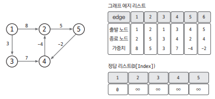
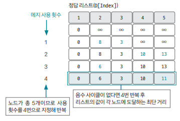
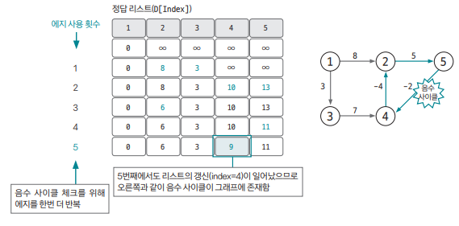

## 개요 

`벨만-포드(Bellman-Ford) 알고리즘` : 그래프에서 최단 거리를 구하는 알고리즘

- 기능 : 특정 노드에서 출발해 다른 모든 노드까지의 최단 경로 탐색 
- 특징  
    1) `음수 가중치` 엣지가 있어도 알고리즘 수행 가능
    2) `음수 사이클 존재 여부`를 판단할 수 있음
- 시간 복잡도   
    - O(V*E) (V : 노드 수, E : 엣지 수)

## 핵심 이론

다음 3가지 단계의 원리로 동작한다

### 1. 엣지 리스트로 그래프 구현 & 최단 경로 리스트 초기화 

기본적으로 `엣지를 중심`으로 동작하는 알고리즘이기 때문에 그래프를 `엣지 리스트로 구현`한다

최단 경로 리스트는 `출발 노드는 0`, `나머지 노드는 아주 큰 값`으로 초기화한다

ex) 



### 2. 모든 엣지를 확인해 정답 리스트 업데이트 

최단 거리 리스트에서 `업데이트 반복 횟수`는 `노드 개수 - 1`이다.  
노드 개수가 N이고 음수 사이클이 없을 때 특정 두 노드의 최단 거리를 구성할 수 있는 엣지의 최대 개수는 N-1이기 때문이다.

엣지 E = (출발지 s, 목적지 e, 가중치 w)에서 다음 조건을 만족하면 업데이트를 실행한다.

`업데이트 반복 횟수가 K번`이라면 해당 시점의 정답 리스트의 값은 `시작점에서 K개의 엣지를 사용`했을 때 `각 노드에 대한 최단 거리`를 의미한다.

```
업데이트 조건과 방법
- 조건 : D[s] != ∞ AND D[e] > D[s] + w 
- 변경 : D[e] <= D[s] + w 로 수정 
```



음수 사이클이 없을 때 N-1번 엣지 사용 횟수를 반복하면 `출발 노드`와 `모든 노드 간`의 최단 거리를 알려주는 정답 리스트가 완성된다.

이렇게 완성하고 나서 마지막으로 그래프에 `음수 사이클이 존재하는지 확인`해야 한다.

### 3. 음수 사이클 유무 확인

```
모든 엣지를 한 번씩 다시 사용해 업데이트되는 노드가 발생하는지 확인한다
```

`업데이트되는 노드가 있다`면 `음수 사이클이 있다`는 뜻  
이는 2번째 단계에서 도출한 정답 리스트가 무의미하고 최단 거리를 찾을 수 없는 그래프라는 걸 의미한다.

왜냐하면, 음수 사이클이 존재하기 때문에 사이클을 무한히 돌게 되면서 가중치 무한히 감소하기 때문이다.



실제 코딩테스트에서는 벨만-포트 알고리즘을 사용해서 음수 사이클을 판별하는 문제가 자주 출제된다. 