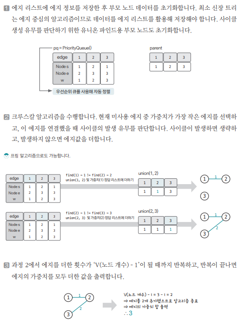

[링크](https://www.acmicpc.net/problem/1197)

## 1. 문제 분석

MST를 구하는 프로그램을 작성해라!

- 1번째 줄 : V (노드 개수), E (엣지 개수)
- 2번째 줄 이후 : A, B, C = A번 노드 & B번 노드가 가중치가 C인 엣지로 연결되어 있다는 의미

--- 

앞서 다룬 핵심 이론을 이용하여 이 문제를 해결한다

## 2. 손으로 풀어보기 



## 3. 슈도코드 

``` 
N : 노드 수, M : 엣지 수 
pq : 엣지 정보를 저장할 우선순위 큐 
parent : 대표 노드를 저장하는 리스트

for M만큼 반복 : 
    pq에 엣지 정보 저장 # 우선순위 큐라서 가중치를 기준으로 자동으로 정렬된다

find(a) : 

    # a가 대표노드라면 바로 return
    if parent[a] == a : 
        return a 

    else :
        # a의 대표 노드 값을 find(parent[a])로 저장
        parent[a] = find(parent[a])

union(a, b) : 

    # a와 b의 대표노드 찾기
    a = find(a) 
    b = find(b)

    # 두 원소의 대표 노드끼리 연결
    # b 노드가 a 노드가 속한 집합에 포함되도록 
    parent[b] = a

# MST 실행
useEdge : 사용 엣지 수를 저장하는 변수
result : 정답 변수

while 사용한 엣지 수 < 노드 수 - 1 : 

    큐에서 엣지 정보 가져오기 

    # 두 점을 연결하더라도 사이클이 생기지 않는 경우
    if 엣지 시작점의 부모 노드 != 엣지 끝점의 부모 노드 : 
        union 연산 수행
        result += 엣지 가중치 # 엣지 가중치를 정답에 더하기
        사용 엣지 수 1 증가

print(result)

```

[코드](../../code/day19/64_최소신장트리구하기.py)