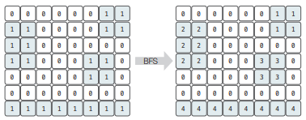
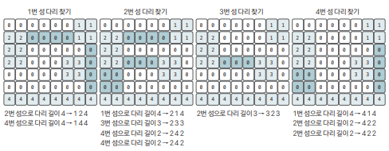
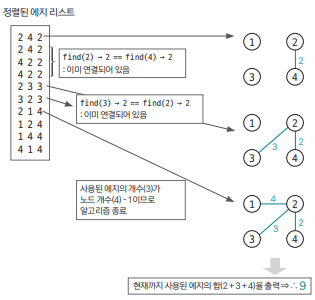

[링크](https://www.acmicpc.net/problem/17472)

## 1. 문제 분석

섬으로 이뤄진 나라가 모든 섬을 다리로 연결하려고 한다. 지도는 N * M 크기의 2차원 격자로 표현되었다.

색칠되어 있는 칸은 땅 / 그렇지 않은 칸은 바다다.

- 다리의 양끝은 섬과 인접한 바다 위에 있어야 한다
- 한 다리의 방향은 중간에 바뀌지 않는다. 때문에 다리는 가로 또는 세로 방향밖에 없다
- 다리의 길이는 2 이상이어야 한다
- 섬 A와 B를 연결하는 다리가 중간에 섬 C와 인접한 바다를 지나간다고 해서 섬 C가 A, B와 연결되는 건 아니다 

--- 

데이터 크기는 매우 작은 편이라 시간 복잡도의 제약은 크지 않다.  
다만, 여러 단계로 나눠서 생각해야 할 문제이다.

1. 주어진 지도에서 섬으로 표현된 값을 각각 다르게 표현해야 한다.  
2. 각 섬의 모든 위치에서 다른 섬으로 연결할 수 있는 엣지가 있는지 확인해서 엣지 리스트를 만든다.  
3. MST를 적용해서 최종적으로 문제를 해결한다.

## 2. 손으로 풀어보기 

1단계. 
- 지도의 정보를 2차원 리스트에 저장 
- 섬으로 표시된 모든 점에서 BFS를 실행해 각각의 섬을 구분한다.  
    - 방문한 적이 없고 바다가 아니라면 같은 섬으로 인식



2단계. 
- 모든 섬에서 상하좌우로 다리를 만들어서 다른 섬과 연결할 수 있는지 확인
    - 연결할 곳이 섬이면 탐색 중단
    - 바다라면 탐색 지속
    - 다른 섬을 만났을 때 다리의 길이가 2 이상이라면 이 다리를 엣지 리스트에 추가



3단계. 이전 단계에서 수집한 모든 엣지를 오름차순 정렬해 MST 알고리즘 수행. 끝난 후 사용한 엣지의 합을 출력 




## 3. 슈도코드 

``` 
dr, dc : 4방향 탐색을 위한 상수 
N, M : 행렬의 크기 

myMap : 맵 정보를 저장하는 리스트
visited : BFS 수행할 때 방문 여부 저장 리스트

for N만큼 반복 : 
    지도 정보를 myMap에 저장 

sNum : 섬 번호 
sumlist : 모든 섬 정보를 저장한 이중 리스트
mlist : 1개의 섬 정보를 저장한 리스트

addNode(i, j, queue) : # 섬에 한 칸을 더해주는 함수
    myMap에서 (i, j) 위치에 섬 번호 저장
    visited[해당 위치] = True # 해당 위치를 방문했다는 걸 표시 
    섬 정보(mlist)에 해당 노드 추가 
    BFS를 위한 큐에 해당 노드 추가 

BFS(i, j) # 탐색을 통해 섬 정보를 저장 

    (i, j) 위치에서 4방향으로 이웃한 모든 노드를 탐색해 1개 섬의 영역을 저장 
    연결된 새로운 노드가 확인되면 addNode를 통해 정보를 저장

# 섬 구분 작업 수행 
for i -> N만큼 반복 : 
    for j -> M만큼 반복 : 
        BFS(i, j) # BFS를 실행해서 하나의 섬 정보를 가져온다
        BFS 결과(하나의 섬 정보)를 sumlist에 추가 
        sNum의 값을 하나 증가 

pq : 우선순위 큐 

for sumlist 크기만큼 반복 : 
    now <- sumlist에서 추출 
    for now 크기만큼 반복 : 
        1개의 섬의 모든 위치에서 만들 수 있는 다리 정보 저장 
        # 4방향을 탐색해서 우선순위 큐에 엣지 정보를 저장 

union(a, b) : 
    a, b의 대표노드 찾기
    두 원소의 대표노드끼리 연결 

find(a) : 
    a가 대표 노드면 리턴
    아니면 a의 대표 노드값을 find(parent[a])값으로 저장 

parent : 대표 노드를 저장하는 리스트 

useEdge : 사용한 엣지 개수
result : 정답 변수 

while 큐가 빌 때까지 : 
    큐에서 엣지 정보 가져오기 

    # 연결해도 사이클이 생기지 않는다면
    if parent[엣지 시작점] != parent[엣지 끝점] : 
        union 연산 수행
        엣지 가중치를 정답 변수에 더하기 
        사용한 엣지의 수 1 증가

if 사용한 엣지의 수 == 노드 - 1 : 
    print(result)
else : 
    print(-1)
```

[코드](../../code/day19/65_다리만들기.py)