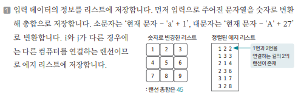
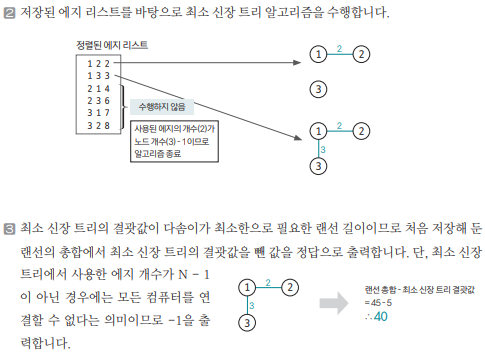

[링크](https://www.acmicpc.net/problem/1414)

## 1. 문제 분석

N개의 방에 각각 1개의 컴퓨터가 있다. 각 컴퓨터는 랜선으로 연결되어 있다.  

컴퓨터 A와 B가 있을 때 
- A와 B가 랜선으로 직접 연결되어 있거나  
- 다른 컴퓨터를 통해 연결되어 있으면

서로 통신할 수 있다.

집에 있는 N개의 컴퓨터를 모두 연결하고 싶은데  
N개의 컴퓨터가 연결되어 있는 랜선의 길이가 주어졌을 때 최대 어느 정도의 랜선을 버릴 수 있을지 구하는 프로그램을 작성하자.

- 1번째 줄 : 컴퓨터 개수  
- 2번째 줄 이후 

랜선 길이는 a ~ z = 1 ~ 26 / A ~ Z : 27 ~ 52를 의미한다

```
3
abc # 1번 컴퓨터는 1번 컴퓨터와 연결된 랜선 길이가 a = 1
    # 1번 컴퓨터는 2번 컴퓨터와 연결된 랜선 길이가 b = 2 
    # 1번 컴퓨터는 3번 컴퓨터와 연결된 랜선 길이가 c = 3 

def # 2번 컴퓨터는 1번 컴퓨터와 연결된 랜선 길이가 d = 4 
    # 2번 컴퓨터는 2번 컴퓨터와 연결된 랜선 길이가 e = 5
    # 2번 컴퓨터는 3번 컴퓨터와 연결된 랜선 길이가 f = 6 

ghi # 3번 컴퓨터는 1번 컴퓨터와 연결된 랜선 길이가 g = 7
    # 3번 컴퓨터는 2번 컴퓨터와 연결된 랜선 길이가 h = 8
    # 3번 컴퓨터는 3번 컴퓨터와 연결된 랜선 길이가 i = 9
```

--- 

`인접 행렬의 형태`로 데이터가 입력되기 때문에 이 부분을 `MST가 가능한 형태로 변형`하는 것이 문제의 핵심이다.

1) 문자열로 주어진 랜선의 길이를 숫자로 변형해 랜선 길이의 총합을 저장  
2) i == j인 값은 같은 컴퓨터를 연결한다는 의미 => 굳이 엣지로 저장할 필요없음
3) 나머지 위치의 값들로 i->j 로 가는 엣지를 생성 & 엣지 리스트에 저장 

이 과정을 거쳐서 MST 문제로 변형하자

## 2. 손으로 풀어보기 

1. 주어진 입력 데이터를 바탕으로 랜선 길이의 총합과 엣지 리스트를 만든다





## 3. 슈도코드 

``` 
N : 컴퓨터의 개수 
pq : 랜선 정보를 저장할 우선순위 큐 
sum : 모든 랜선의 합을 저장하는 변수 

for N만큼 반복 : 
    한 줄씩 문자열 데이터를 받기 

    for N만큼 반복 : 
        if 소문자일 때 : 
            현재 문자 - 'a' + 1
        elif 대문자일 때 : 
            현재 문자 - 'A' + 27

        sum += 현재 랜선 길이

        if i != j and 현재 랜선 길이가 0이 아니라면 : 
            랜선 정보를 큐에 저장 

parent : 대표 노드를 저장하는 리스트 

find(a) : 
    if a == parent[a] : 
        return a 
    
    else : 
        parent[a] = find(parent[a])
        return parent[a]

union(a, b) : 
    a = find(a)
    b = find(b)

    parent[b] = a

# MST 실행 
useEdge : 사용한 엣지의 개수를 저장하는 변수 
result : 최소 신장 트리의 결과값 

while 큐가 빌 때까지 : 
    큐에서 엣지 정보 가져오기 

    # 연결해도 사이클이 생기지 않는 경우 
    if 엣지 시작점과 끝점의 부모노드가 다르면 : 
        union 연산 수행 
        엣지 가중치를 정답 변수에 더하기
        useEdge += 1 # 사용 엣지 수 1 증가 

if useEdge == 노드 - 1 : 
    모든 랜선의 합에서 최소 신장 트리의 결과값을 뺀 값을 출력 

else : 
    -1 출력 
```

[코드](../../code/day19/66_불우이웃돕기.py)