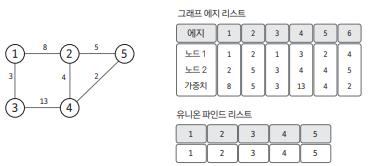
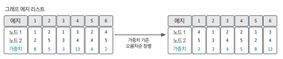
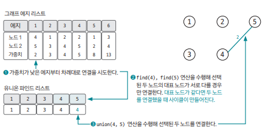
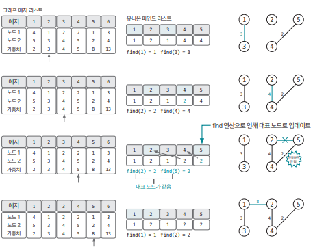
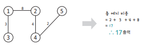

## 개요 

최소 신장 트리(Minimum Spanning Tree) : 그래프에서 모든 노드를 연결할 때 사용된 `엣지들의 가중치 합을 최소`로 하는 트리 

- 특징  
1. 사이클이 포함되면 가중치의 합이 최소가 될 수 없다. 따라서, 사이클을 포함하지 않는다.  
2. `N개의 노드`가 있으면 MST를 구성하는 `엣지의 개수`는 항상 `N-1`개다.

## 핵심 이론

### 1. 엣지 리스트로 그래프 구현 & union-find 리스트 초기화 

MST는 데이터를 `엣지 중심`으로 저장하기 때문에 `엣지 리스트 형태`로 그래프를 구현해야 한다. 

이때 엣지 리스트는 일반적으로 노드 변수 2개, 가중치 변수로 구성된다.

`cycle 처리`를 위한 union-find 리스트도 함께 초기화한다. 리스트의 인덱스를 해당 자리의 값으로 초기화하면 된다.

### 2. 그래프 데이터를 `가중치를 기준`으로 정렬 

엣지 리스트에 담긴 그래프 데이터를 `가중치 기준`으로 오름차순 정렬한다

### 3. 가중치가 낮은 엣지 부터 연결 시도 

1. 가중치가 낮은 엣지 부터 연결 시도  
2. 엣지를 통해 노드를 연결했을 때 그래프에 사이클이 생성되는지 여부를 find 연산을 통해 먼저 확인한다.
3. 사이클이 형성되지 않는다면 union 연산을 이용해서 노드를 서로 연결한다

### 4. 과정 3 반복 

전체 노드 개수 N개일 때, 연결한 엣지 개수가 N-1이 될 때까지 과정 3 반복 

### 5. 총 엣지 비용 출력 

연결한 엣지 개수가 N-1이 될 때 알고리즘 종료 & 완성된 MST의 총 엣지 비용을 출력한다

