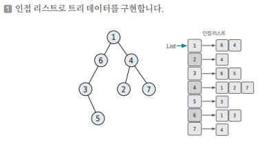
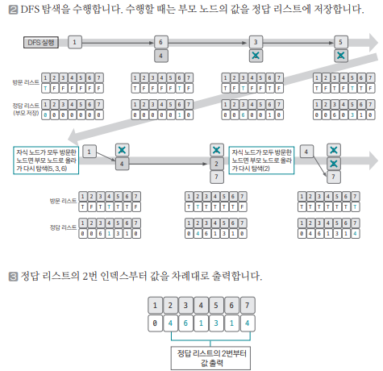

[링크](https://www.acmicpc.net/problem/11725)

## 1. 문제 분석

루트 없는 트리가 주어진다. 트리의 루트를 1이라고 정했을 때 각 노드의 부모를 구하는 프로그램을 작성하자.

---

주어진 데이터는 `연결되어 있는 두 노드`를 알려준다. 때문에 데이터를 저장할 때 양방향 엣지로 간주하고 저장한다. 

여기서 `인접 리스트 자료구조`를 사용하면 간편하게 데이터를 저장할 수 있다.  

트리의 루트가 1이라고 했기 때문에 1번 노드부터 DFS로 탐색하면서 부모 노드를 찾아주면 문제를 쉽게 해결할 수 있다. 

## 2. 손으로 풀어보기 





트리는 `그래프 자료구조 중 하나의 형태`이므로 그래프를 구현하는 방식을 사용할 수 있고, 탐색 역시 그래프 탐색 알고리즘을 사용할 수 있다.

## 3. 슈도코드 

``` 
N : 노드 개수 
visited : 방문 기록을 저장하는 리스트 
tree : 그래프 데이터를 저장할 인접 리스트 
answer : 부모 노드를 저장하는 정답 리스트 

for N-1의 개수만큼 반복 : 
    tree 인접 리스트에 트리 데이터 저장 

# DFS 구현 
DFS(현재 노드) : 
    visited[현재 노드] = True # 현재 노드를 방문했다고 기록 

    for 현재 노드와 이웃한 노드 : 
        if 아직 방문하지 않은 노드라면 : 

            미 방문 노드의 부모 노드로 현재 노드 저장 
            DFS(미 방문 노드)

DFS(1번 노드) # 루트 노드에서 DFS 실행 

for 2~N 반복 : 
    answer 리스트 출력

```

[코드](../../code/day20/67_트리의부모찾기.py)

