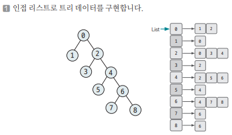
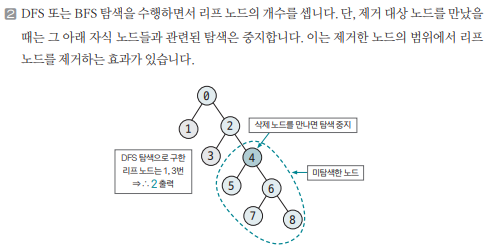

[링크](https://www.acmicpc.net/problem/1068)

## 1. 문제 분석

트리가 있다. 

여기서 노드 하나를 지우면 그 노드와 노드의 모든 자식 노드도 트리에서 제거된다. 

주어진 트리에서 1개의 노드를 지울 때 남은 트리에서의 리프 노드 개수를 구하시오.

- 1번째 줄 : 트리의 노드 개수 (최대 50)
- 2번째 줄 : 각 노드의 부모 노드가 차례대로 주어진다. 부모가 없다면 루트 노드 -1이 주어진다.
- 3번째 줄 : 삭제할 노드의 번호

---

핵심 : 리프 노드를 어떻게 제거해야 할까

리프 노드를 탐색하는 탐색 알고리즘을 수행하면서   
==> 제거하는 노드가 나왔을 때 탐색을 종료하는 아이디어를 적용하면  
==> 실제 리프 노드를 제거하는 효과를 낼 수 있다.

## 2. 손으로 풀어보기 





## 3. 슈도코드 

``` 
N : 노드 개수
tree : 그래프 데이터를 저장하는 인접 리스트 
visited : 방문 기록을 저장하는 리스트 
answer : 리프 노드 개수를 저장하는 변수
p : 입력 데이터를 저장하는 리스트

for N만큼 반복 : 
    if 루트 노드가 아니면 : 
        tree 인접 리스트에 트리 데이터 저장
    else : 
        루트 노드값 저장

# DFS 탐색 함수
DFS(현재 노드) : 
    visited[현재 노드] = True 
    
    for 이웃 노드 in 현재 노드 : 
        
        if not visited[이웃 노드] and 이웃 노드 != 삭제 노드 : 
            자식 노드 개수 증가 
            DFS(이웃 노드)
        if 자식 노드 개수 == 0 : 
            answer += 1 

deleteNode(삭제 노드값 저장)

if 삭제 노드 == root노드 : 
    모두 삭제되는 상황. 따라서, 0을 출력하고 프로그램 종료

else : 
    DFS(root)
    print(answer)
```

[코드](../../code/day20/68_리프노드의개수구하기.py)