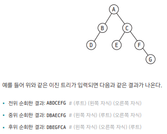
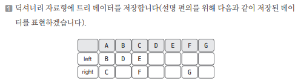

[링크](https://www.acmicpc.net/problem/1991)

## 1. 문제 분석

이진 트리를 입력받아 전위 순회, 중위 순회, 후위 순회한 결과를 출력하는 프로그램을 작성하자



--- 

문제가 요구하는 자료구조 형태를 충실히 구현하면 된다.

문제에서 주어진 입력값을 `트리 형태의 자료구조`에 적절하게 저장하고  
그 안에서 탐색을 수행하는 로직을 구현하자.

여기서는 딕셔너리 자료형을 이용해 구현하도록 하겠다.

## 2. 손으로 풀어보기 



2. 전위 함수를 구현해서 실행 
- 순서 : 현재 노드 => 왼쪽 노드 => 오른쪽 노드 

3. 중위 함수를 구현해서 실행 
- 순서 : 왼쪽 노드 => 현재 노드 => 오른쪽 노드

4. 후위 함수를 구현해서 실행 
- 순서 : 왼쪽 노드 => 오른쪽 노드 => 현재 노드

## 3. 슈도코드 

``` 
N : 노드 개수 
tree : 딕셔너리를 사용해서 tree 데이터 저장

for N만큼 반복 : 
    root, left, right 데이터 받기
    tree 딕셔너리에 데이터 저장

# 전위 순회
preOrder(현재 노드) : 

    if 현재 값 == '.' : 
        return 
    
    1. 현재 노드 출력
    2. 왼쪽 노드 출력
    3. 오른쪽 노드 출력

# 중위 순회
inOrder(현재 노드) : 

    if 현재 값 == '.' : 
        return 
    
    1. 왼쪽 노드 출력
    2. 현재 노드 출력
    3. 오른쪽 노드 출력

# 후위 순회
postOrder(현재 노드) : 

    if 현재 값 == '.' : 
        return 
    
    1. 왼쪽 노드 출력
    2. 오른쪽 노드 출력
    3. 현재 노드 출력

preOrder -> inOrder -> postOrder 순서로 실행 및 결과 출력
```

[코드](../../code/day21/70_트리순회하기.py)