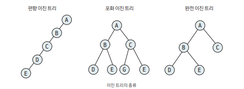
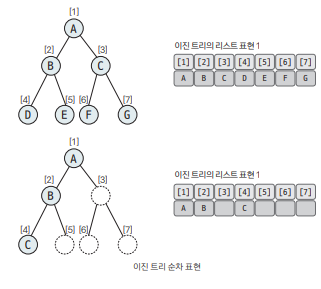

## 개요

이진 트리(Binary Tree) : 각 노드의 자식 노드의 개수가 2 이하로 구성되어 있는 트리

## 핵심 이론

### 종류 

- 편향 이진 트리 : 노드들이 한쪽으로 편향되어 생성된 이진트리
- 포화 이진 트리 : 트리의 높이가 모두 일정 & 리프 노드가 모두 존재하는 이진트리
- 완전 이진 트리 : 마지막 레벨을 제외하고 완전하게 노드들이 채워진 이진 트리. 마지막 레벨은 왼쪽부터 채워졌다.

일반적으로 코팅 테스트에서 데이터를 트리에 저장한다고 하면 `완전 이진 트리 형태`를 생각하면 된다.

### 순차 표현 

가장 직관적이면서 편리하게 이진 트리를 표현하는 자료구조는 `리스트`이다.

위와 같이 1차원 리스트의 형태로 표현할 때 트리의 노드와 리스트의 인덱스간의 상관관계를 살펴보자.

