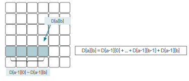
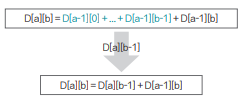
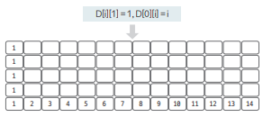
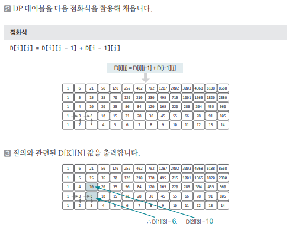

[링크](https://www.acmicpc.net/problem/2775)

## 1. 문제 분석

아파트 거주 조건 : a층의 b호에 거주하려면 (a-1)층의 1~b호의 사람들의 수의 합만큼 사람들을 데려와 살아야 한다

아파트에 비어있는 집은 없고 모든 거주민들이 이 계약 조건을 지켜왔다고 가정할 때 

주어진 양의 정수 k, n에 대해 k층의 n호에 몇 명이 살고 있는지 출력하자  
(단, 아파트는 0층부터, 각 층에는 1호부터 있고 0층의 i호에는 i명이 산다)

k, n의 최댓값은 14

--- 

조합의 점화식을 도출하는 방법을 응용해 이 문제에서 사용할 점화식을 도출하면 쉽게 해결할 수 있다. 

"a층의 b호에 거주하려면 (a-1)층의 1~b호의 사람들의 수의 합만큼 사람들을 데려와 살아야 한다"라는 조건은 아래 표처럼 표현할 수 있다.



위 내용을 좀 더 응용하면 다음과 같이 점화식을 변경할 수 있다. 



이렇게 도출된 점화식을 이용해 문제를 해결해보자.  
층 수가 매우 적은 편이므로 모든 아파트 층수에 관해 먼저 구해놓고 테스트 케이스를 실행하자.

## 2. 손으로 풀어보기 

1. DP 테이블 초기화 
- D[i][1] = 1 # 1호실에는 항상 값을 1로 초기화
- D[0][i] = i # 0층의 i호의 수는 i로 초기화





## 3. 슈도코드 

``` 
D : DP 리스트 

for i -> 14만큼 반복 : 
    D 리스트 초기화
    D[i][1] = 1
    D[0][i] = i

for i -> 1~14 : 
    for j -> 2~14 : 
        D[i][j] = D[i][j-1] + D[i-1][j]

T : 테스트 케이스 

for T만큼 반복 : 
    K, N 입력받기 
    D[K][N] 출력 
```

[코드](../../code/day24/78_부녀회장이될거야.py)