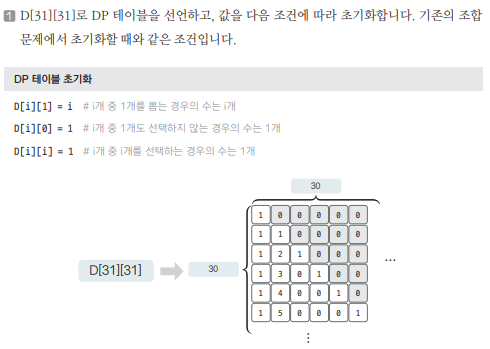
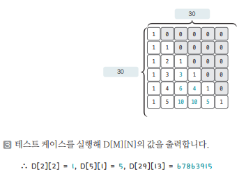

[링크](https://www.acmicpc.net/problem/1010)

## 1. 문제 분석

사이트 : 강 주변에서 다리를 짓기에 적합한 곳 

강의 서쪽에는 N개, 동쪽에는 M개의 사이트가 있다. (N ≤ M, N과 M의 최댓값 29)

서쪽의 사이트와 동쪽의 사이트를 다리로 연결하려고 하는데 한 사이트에는 최대 1개의 다리만 연결될 수 있다.

다리를 최대한 많이 짓고 싶기 때문에 서쪽의 사이트 개수 N만큼 다리를 지으려고 한다. 다리끼리는 서로 겹칠 수 없다고 할 때 다리를 지을 수 있는 경우의 수를 구하는 프로그램을 만들자

--- 

문제의 핵심은 `문제를 보고 조합 문제로 생각할 수 있는지 여부`이다.  
문제의 조건 중 `다리끼리는 서로 겹칠 수 없다`는 조건이 있었다. 

그렇다면 문제를 `M개의 사이트에서 N개를 선택하는 문제`로 변경할 수 있다. 

왜냐하면, 동쪽에서 N개의 다리를 선택한 후 맨 위에서부터 차례대로 다리를 연결하면 자연스럽게 서로 겹치지 않게 다리를 만들 수 있기 때문이다.

## 2. 손으로 풀어보기 



2. 점화식을 이용해 DP 테이블을 채운다. N, M의 최댓값이 30보다 작으니까 DP 테이블의 값을 미리 채워넣는다.

```
점화식 : D[i][j] = D[i-1][j] + D[i-1][j-1]
```



## 3. 슈도코드 

``` 
D : DP 테이블 

for i -> 0~30 반복 : 
    D 리스트 초기화 

    D[i][1] = i # i개 중 1개 선택하는 경우의 수 = i
    D[i][0] = 1 # i개 중 0개 선택하는 경우의 수 = 1
    D[i][i] = 1 # i개 중 i개 선택하는 경우의 수 = 1

for i -> 2~30 반복 : 
    for j -> i만큼 반복 : 
        D[i][j] = D[i-1][j] + D[i-1][j-1]

T : 테스트 케이스 

for T 개수 : 
    N, M의 값 입력받기 
    D[M][N] 출력 
```

[코드](../../code/폴더/파일이름.py)