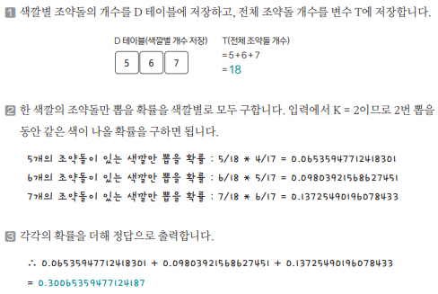

[링크](https://www.acmicpc.net/problem/13251)

## 1. 문제 분석

박스 안에 조약돌 N개가 있다. 조약돌의 색깔은 1~M 중 1개다. 

박스에서 조약돌을 임의로 K개 뽑았을 때 조약돌이 모두 같은 색일 확률을 구하는 프로그램을 만들자.

- 1번째 줄 : M (= 조약돌의 색깔 개수)
- 2번째 줄 : 각 색깔별 조약돌의 개수 리스트
- 3번째 줄 : K

---

지금까지 공부한 내용을 활용한다면...

- 전체 돌을 뽑는 경우의 수를 구하고 
- 색깔별로 있는 조약돌들 중에서 K개를 뽑을 수 있는 경우의 수를 구해서 
- (K개를 뽑는 경우의 수) / (전체 경우의 수) 를 통해서 문제를 해결할 수 있다.

하지만, 이 문제는 `단순하게 확률식을 만들어서` 해결할 수도 있다.  

이 문제를 통해 내가 알고 있는 알고리즘에 문제를 맞추려고 하지 말고 좀 더 다양하게 문제를 분석해보자.

## 2. 손으로 풀어보기 



## 3. 슈도코드 

``` 
T : 전체 조약돌 개수 
D : 색깔별 조약돌 개수 저장 리스트 
probability : 색깔별 확률 저장 리스트 
M : 색의 종류 

for i->M만큼 반복 : 
    T 변수에 조약돌 개수 더하기 

K 변수 : 선택할 조약돌 개수 

for i -> M만큼 반복 : 

    if 현재 색깔의 조약돌의 개수 > 선택해야 할 개수 : 
        probability[i] = 1로 저장 

        for j -> K만큼 반복 : 
            i 색깔을 모두 뽑을 확률 = i 색깔을 모두 뽑을 확률 * (현재 색깔 개수 - K) / (전체 색깔 개수 - K)

            정답 += probability[i]

print(정답)
```

[코드](../../code/day24/80_조약돌꺼내기.py)