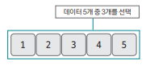
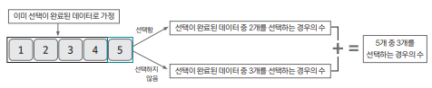

## 알고리즘을 위한 핵심사항 

`조합`은 DP(동적 계획법)의 시작이라고 볼 수 있다.  
그래서 알고리즘에서 조합을 구현할 때 수학 공식을 코드화하지 않고 `점화식`을 사용해 표현한다.

3가지 단계를 거쳐서 조합의 점화식을 만들어보자.

### 1. 예시 문제

5개의 데이터 중 3개를 선택하는 조합의 경우의 수 구하기 



### 2. 모든 부분 문제가 해결된 상황이라고 가정하고 지금 문제 생각하기 

5개의 데이터 중 `4개가 이미 선택 여부`가 결정되었다고 가정 

그러면 `5번째 데이터의 선택 여부`에 따른 경우의 수를 구해야 한다.  
때문에 아래와 같이 2가지 경우를 만들 수 있다.

- 5번째 데이터가 포함됨 = 이미 4개 중 2개의 데이터가 선택되어 있어야 함
- 5번째 데이터가 포함되지 않음 = 이미 4개 중 3개의 데이터가 선택되어 있어야 함

위 2가지 경우의 수를 합치면 데이터 5개 중 3개를 선택하는 경우의 수가 나온다.



위 그림을 점화식으로 표현하면 아래와 같다.

```
D[5][3] = D[4][2] + D[4][3]
```

이렇게 결론을 낼 때 D[4][2], D[4][3]을 구해야 하는 건 아닌지 의문이 생긴다.  
하지만, 각 경우의 수를 하나하나 구하기 이전에 `점화식을 도출`하기 위해서 가정한 것이다. 

이렇게 점화식을 도출하고 나면 프로그램의 로직을 통해 자연스럽게 경우의 수를 구할 수 있게 된다.

### 3. 특정 문제를 해결한 내용을 바탕으로 일반 점화식 도출 

앞선 예시 

```
5개의 데이터 중 3개를 선택하는 조합의 경우의 수

D[5][3] = D[4][2] + D[4][3]
```

일반화 

```
i개의 데이터 중 j개를 선택하는 조합의 경우의 수

D[i][j] = D[i-1][j-1] + D[i-1][j]
```
