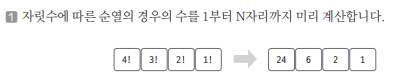
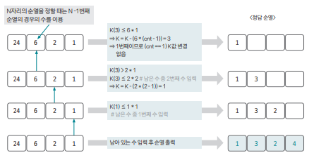

[링크](https://www.acmicpc.net/problem/1722)

## 1. 문제 분석

1~N까지의 수를 임의로 배열한 순열의 경우의 수는 `N!`이다. 

```
ex) N = 3
{1, 2, 3}, {1, 3, 2}, {2, 1, 3}, {2, 3, 1}, {3, 1, 2}, {3, 2, 1}의 순서로 정렬된다.

```

N이 주어질 때 다음 2개의 소문제 중 1개를 해결하는 프로그램을 작성할 것.

1) K가 주어지면 K번째 순열을 구한다
2) 임의의 순열이 주어지면 그 순열이 몇 번째 순열인지 구한다

- 1번째 줄 : 순열의 개수 N (최대 20)
- 2번째 줄 : 1번째 수 = 소문제 번호 / 번호가 1이면 K값이 주어지고 번호가 2이면 임의의 순열이 주어진다.

---

조합과 달리 `순열`은 순서가 다르면 다른 경우의 수로 인정된다. 

그리고 N자리로 만들 수 있는 순열의 경우의 수를 구해야 한다는 것이 핵심이다.  

ex) 4자리로 만들 수 있는 모든 순열의 경우의 수 : 4 * 3 * 2 * 1 = 4! = 24가지 

## 2. 손으로 풀어보기 



2. 소문제 1을 풀어보자 (예제에서 주어진 K = 3)

1) `주어진 값(K)`과 `현재 자리(N) - 1`에서 만들 수 있는 경우의 수를 비교한다  
2) `1)`에서 K가 더 작아질 때까지 경우의 수를 배수(cnt)로 증가시킨다. (순열의 순서를 1씩 늘림)  
3) K가 더 작아지면 순열에 값을 저장하고 K를 `(경우의 수 * (cnt - 1))`로 업데이트  
4) 순열이 완성될 때까지 1~3을 반복하고 완료된 순열을 출력한다



3. 소문제 2를 풀어보자 (예제에서 주어진 순얼 1 3 2 4)

1) 현재 자릿수의 숫자를 확인하고 해당 숫자보다 앞에 있는 숫자 중에서 사용하지 않은 숫자 개수를 센다.  
2) (사용하지 않은 숫자 개수) * (현재 자리 - 1에서 만들 수 있는 순열 개수)를 K에 더한다   
3) 모든 자릿수에 관해 1~2를 반복한 후 K값을 출력한다.

## 3. 슈도코드 

``` 
F : 자리별로 만들 수 있는 경우의 수 저장하기 -> 팩토리얼 형태 
S : 순열을 담는 리스트 
visited : 숫자 사용 여부를 저장하는 리스트
N : 순열의 길이 

# F 리스트 초기화 
for i -> 1~N : 
    F[i] = F[i-1] * i 

inputList : 문제 종류 및 순열 데이터 받기 

# 소문제 1번 
if inputList[0] == 1 : 
    K : 몇 번째 순열을 출력할 지 입력받음 ==> 길이가 N인 순열의 K번째 순열을 출력해야 하는 구나!

    for i -> N만큼 반복 :   
        
        cnt = 1 
        for j -> N만큼 반복 : 
            이미 사용한 숫자는 계산하지 않음 

            if 현재 순서 < 해당 자리 순열 수 * cnt : 
                현재 순서 = 현재 순서 - 해당 자리 순열 수 * (cnt - 1)
                현재 자리(S[i])에 j값 저장 
                숫자 j를 사용 숫자로 체크 
                반복문 종료 
            
            cnt값 1 증가 
    S 리스트 출력 

# 소문제 2번 
else : 
    K : 순열의 순서 저장 변수 

    for i -> N만큼 반복 : 
        cnt : 0으로 초기화 

        for j -> inputList[i]의 수만큼 반복 : 
            if 사용한 숫자가 아니면 : 
                cnt += 1 

        K = K + cnt * 현재 자릿수에서 만들 수 있는 경우의 수 
        inputList[i]번째 숫자를 사용 숫자로 변경

    K 출력 

```

[코드](../../code/day25/81_순열의순서구하기.py)