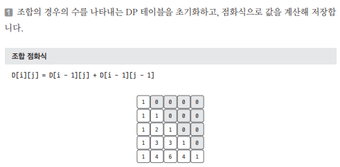
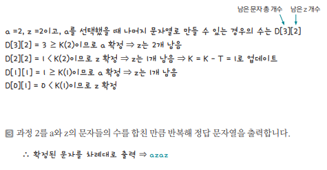

[링크](https://www.acmicpc.net/problem/1256)

## 1. 문제 분석

N개의 a와 M개의 z로 이뤄진 문자열이 있다.  

(N+M)개의 a, z로 이뤄진 문자열을 알파벳 순서로 정렬할 때 K번째 문자열이 무엇인지 구하시오

ex) N = 2, M = 2, K = 2 ==> `azaz`

--- 

핵심 아이디어는 a와 z의 개수가 각각 N, M일 때   
이 문자들로 만들 수 있는 모든 경우의 수는  
- `N+M개`에서 N개를 뽑는 경우의 수 또는 
- `N+M개`에서 M개를 뽑는 경우의 수와 동일하다는 것이다.

## 2. 손으로 풀어보기 



2. 몇 번째 문자열을 표현해야 하는지 나타내는 변수를 K라고 하자. 현재 자릿수에서 a를 선택했을 때 남아 있는 문자들로 만들 수 있는 모든 경우의 수를 T라고 하겠다.

- T >= K : 현재 문자를 a로 선택 
- T < K : 현재 문자를 z로 선택. K = K - T로 업데이트



## 3. 슈도코드 

``` 
N : a 문자 개수 
M : z 문자 개수 
K : 순서 

D : 조합 경우의 수를 저장할 테이블 

# 조합 테이블 만들기 
for i in range(201) : 
    for j in range(i+1) : 
        D[i][j] = D[i-1][j] + D[i-1][j-1]
        D[i][j] 값이 K의 범위를 벗어날 때 K 범위의 최댓값으로 D[i][j] 저장 

if 불가능한 K이면 : 
    -1 출력 

else : 
    while 모든 문자를 사용할 때 까지 : 
        if a 문자를 선택했을 때 남은 문자들로 만들 수 있는 경우의 수 >= K : 
            a 출력 
            N의 수 1 감소 
        
        else : 
            z 출력 
            k값을 계산된 모든 경우의 수를 뺀 값으로 저장
            M의 수 1 감소 
```

[코드](../../code/day25/82_사전찾기.py)