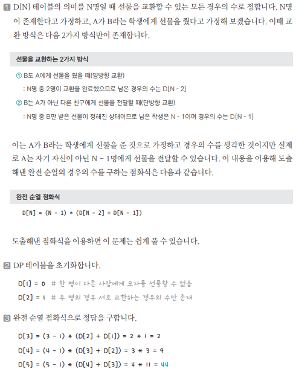

[링크](https://www.acmicpc.net/problem/1947)

## 1. 문제 분석

모든 사람들이 선물을 1개씩 준비한 상황이다. 

모든 사람들은 다른 사람들에게 선물을 1개씩 받는다. 여기서 자기 선물을 자기가 받는 경우는 없다. 

이때, 선물을 나눠줄 수 있는 경우의 수를 구하는 프로그램을 작성하시오

--- 

`완전 순열` 개념을 다루는 문제다.   
완전 순열이란 n개의 원소의 집합에서 원소를 재배열할 때 이전과 같은 위치에 배치되는 원소가 1개도 없는 걸 말한다. 

하지만, 이 문제에서는 문제에 주어진 조건에 따라 `적절한 점화식을 도출`하는 능력이 필요하다. 

## 2. 손으로 풀어보기 



## 3. 슈도코드 

``` 
N : 대회에 참석한 학생 수 
mod = 1000000000 # 나눠야 하는 변수 값

D : N명일 때 선물을 교환할 수 있는 모든 경우의 수를 저장하는 리스트 

D[1] = 0 # 혼자서는 선물을 교환할 수 없음
D[2] = 1 # 2명일 경우에는 서로 교환하는 경우의 수만 존재

for i -> 3~N : 
    i명이 교환할 수 있는 모든 경우의 수 = (i-1) * (D[i-1] + D[i-2]) % mod 

print(D[N])
```

[코드](../../code/day25/83_선물전달하기.py)