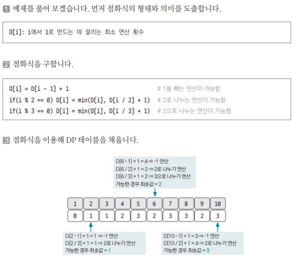

[링크](https://www.acmicpc.net/problem/1463)

## 1. 문제 분석

정수 X에 사용할 수 있는 연산은 다음 3가지다.

1. X가 3으로 나눠떨어지면 3으로 나눈다.  
2. X가 2로 나눠떨어지면 2로 나눈다.  
3. 1을 뺀다

정수 N이 주어졌을 때 연산 3개를 적절히 사용해 1을 만들려고 한다. 연산을 사용하는 횟수의 최소값을 출력하시오

--- 

사용할 수 있는 3가지 연산을 `Bottom-Up 방식`으로 구현할 수 있는지 연습해보는 문제

## 2. 손으로 풀어보기 



연산을 사용하는 횟수의 `최소값`을 구해야 하기 때문에 `min 연산`을 사용했다. 

## 3. 슈도코드 

``` 
N : 구하고자 하는 수 
D : 연산 횟수의 최소값을 저장하는 DP 테이블 
D[1] = 0

for i -> 2 ~ N : 
    D[i] = D[i-1] + 1 # 1을 빼는 연산 

    if 2의 배수 : 
        D[i/2] + 1이 D[i]보다 작으면 변경 # 2로 나누는 연산 

    if 3의 배수 : 
        D[i/3] + 1이 D[i]보다 작으면 변경 # 3으로 나누는 연산 

print(D[N])
```

[코드](../../code/day26/84_정수를1로만들기.py)