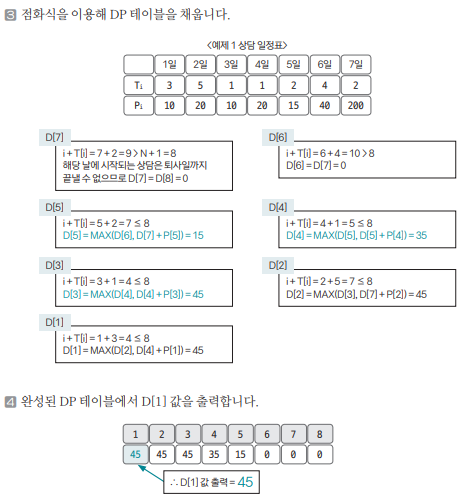

[링크](https://www.acmicpc.net/problem/14501)

## 1. 문제 분석

오늘부터 N일 동안 최대한 많은 상담을 하려고 한다.  

각각의 상담은 상담을 완료하는데 걸리는 기간 (Ti), 상담할 때 받을 수 있는 금액(Pi)로 이뤄져 있다. 

ex) N = 7일 때 상담 일정표 
```
7
3 10 # 1일에 잡힌 상담은 3일이 소요, 받는 금액 10
5 20 # 2일에 잡힌 상담은 5일이 소요, 받는 금액 20
1 10 # 3일에 잡힌 상담은 1일이 소요, 받는 금액 10
1 20 # 4일에 잡힌 상담은 1일이 소요, 받는 금액 20
2 15 # 5일에 잡힌 상담은 2일이 소요, 받는 금액 15
4 40 # 6일에 잡힌 상담은 4일이 소요, 받는 금액 40
2 200 # 7일에 잡힌 상담은 3일이 소요, 받는 금액 200
```

위와 같이 상담하는데 필요한 기간은 1일보다 클 수 있어서 모든 상담을 할 수는 없다. 

위 예시를 보면 `1일에 상담`하면 2일과 3일에 있는 상담은 할 수 없다.  
`2일에 상담`하면 3, 4, 5, 6일에 잡혀있는 상담은 할 수 없다.  
7일 이후에는 회사에 없기 때문에 6, 7일에 있는 상담은 할 수 없다. 

따라서, 7일 동안 할 수 있는 상담의 최대 이익은 1, 4, 5일에 있는 상담을 하는 것이고 이때 받는 금액은 10 + 20 + 15 = 45이다. 

이렇게 최대 수익을 구하는 프로그램을 작성하시오

--- 

여기서 제시하는 점화식만이 정답은 아니다.  
자신만의 아이디어로 적절한 점화식을 찾는 훈련을 반복하는 것이 DP 문제를 해결하는 실력을 늘리는 지름길이다. 

문제의 주요 요소는 날짜 1개 정도라고 판단되어 `1차원 형태의 점화식 D[i]`을 만들려고 한다. 

D[i]의 의미는 i번째 날부터 퇴사일까지 벌 수 있는 최대 수입으로 정의해 문제에 접근해보겠다. 


## 2. 손으로 풀어보기 

1. 점화식의 형태와 의미  
```
D[i] : i번째 날부터 일정이 끝날 때까지 벌 수 있는 최대 수입 
```

2. 점화식을 구한다.
```
D[i] = D[i+1] # 오늘 시작되는 상담을 했을 때 일정 내에 끝나지 않는 경우

D[i] = max(D[i+1], D[i + T[i]] + P[i]) # 오늘 시작되는 상담을 했을 때 일정 내에 끝나는 경우
```



## 3. 슈도코드 

``` 
N : 남은 일수 
D : 점화식 테이블 (i ~ 끝날 때까지 벌 수 있는 최대 수입 저장)
T : 상담에 필요한 일 수를 저장
P : 상담을 완료했을 때 받는 수입을 저장

for N만큼 반복 : 
    T, P 리스트 입력 

for i -> N ~ 1까지 반복 : 
    if i + T[i] > N+1 : # i번째 상담을 마지막 날까지 끝낼 수 없을 때 
        D[i] = D[i+1]

    else : 
        D[i] = max(D[i+1], D[i + T[i]] + P[i])

print(D[1])
```

[코드](../../code/day26/85_퇴사준비하기.py)