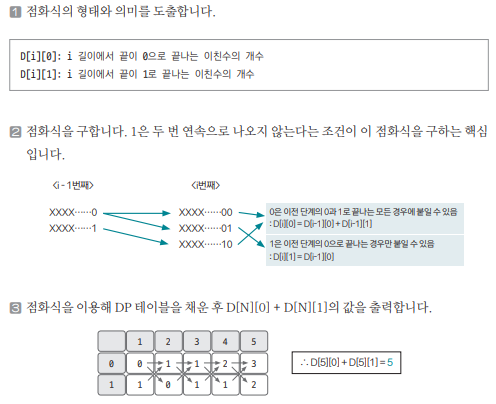

[링크](https://www.acmicpc.net/problem/2193)

## 1. 문제 분석

0과 1로 이뤄진 2진수 중에서 다음 성질을 만족하는 숫자를 `이친수`라고 한다.

- 0으로 시작하지 않는다
- 1이 두 번 연속 나타나지 않는다. 즉, 11을 부분 문자열로 갖지 않는다 

N이 주어졌을 때 N자리 이친수의 개수를 구하는 프로그램을 작성하시오

---

cf) 다양한 점화식을 만들어서 문제를 해결할 수 있음

`이친수의 개수`와 관련된 요소를 찾아보면 `길이`가 중요하다고 판단했다.  
더 나아가 `0으로 끝나는 이친수`와 `1로 끝나는 이친수`를 구분해서 생각하면 좋겠다는 아이디어를 도출할 수 있다.

2차원 배열 점화식을 선언(D[N][2])하고 문제를 해결해보자.

## 2. 손으로 풀어보기 



## 3. 슈도코드 

``` 
D : 점화식 테이블 
# D[i][0] : 길이 i에서 끝이 0으로 끝나는 이친수 개수
# D[i][1] : 길이 i에서 끝이 1로 끝나는 이친수 개수

N : 자릿수
D[1][1] = 1 # 1은 이친수
D[1][0] = 0 # 이친수는 0으로 시작하는 수가 아니다.

for i -> 2~N : 
    i번째 0으로 끝나는 개수 = i-1에서 0으로 끝나는 개수 + i-1에서 1로 끝나는 개수
    i번째 1로 끝나는 개수 = i-1에서 0으로 끝나는 개수

print(N번째에서 0으로 끝나는 개수 + N번째에서 1로 끝나는 개수)
```

[코드](../../code/day26/86_이친수구하기.py)