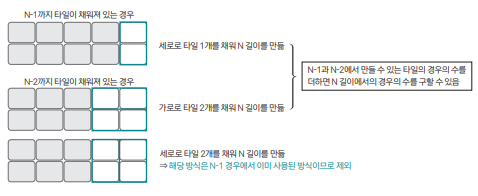

[링크](https://www.acmicpc.net/problem/11726)

## 1. 문제 분석

2 * N 크기의 직사각형을 1 * 2 또는 2 * 1 타일로 채우는 경우의 수를 구하는 프로그램을 작성하시오

--- 

2 * N 크기의 직사각형을 1 * 2 또는 2 * 1 타일로 채우는 경우의 수를 구하는 점화식 D[N]을 정의하자.

점화식을 정의한 후에는 문제가 단순화되도록 가정하는게 중요하다.  
1~(N-1) 크기에 직사각형과 관련된 경우의 수를 모두 구해놓았다고 가정하고 문제에 접근해보자.

N보다 작은 길이의 모든 경우의 수는 이미 계산되어 있다.  
N 바로 직전에 구해야 하는 N-1, N-2에서 N의 길이를 만들기 위한 경우의 수를 생각해보자.



위와 같이 생각한다면 다음과 같은 점화식을 도출할 수 있다.

```
D[N] = D[N-1] + D[N-2]
```

## 2. 손으로 풀어보기 


## 3. 슈도코드 

``` 
mod = 10007

D[N] : 길이가 2*N인 직사각형이 2*1, 1*2 타일을 붙일 수 있는 경우의 수 
D[1] = 1 # 길이가 2*1일 때 붙일 수 있는 타일의 경우의 수 
D[2] = 2 # 길이가 2*2일 때 붙일 수 있는 타일의 경우의 수 

for i -> 3~N : 
    D[i] = D[i-1] + D[i-2]
    나온 결과에 10007 나머지 연산 수행

print(D[N])
```

[코드](../../code/day26/87_2N타일채우기.py)