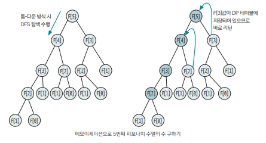

## 개요 

- DP(Dynamic Programming) : 복잡한 문제를 여러 개의 간단한 문제로 분리해 부분 문제를 해결해서 복잡한 전체 문제를 해결하는 방법

## 핵심 이론 

- DP의 원리와 구현 방식 
```
1) 큰 문제를 작은 문제로 나눌 수 있어야 한다
2) 작은 문제들이 반복해서 나타나고 사용되며 이 작은 문제들의 결과값은 항상 같아야 한다
3) 모든 작은 문제들은 1번만 계산해 DP 테이블에 저장된다. => 나중에 재사용할 때는 앞서 저장했던 DP 테이블을 이용한다. (memoization 기법)
4) top-down 방식, bottom-up 방식으로 구현할 수 있다.
```

## 예시 문제 : 피보나치 수열 

- 피보나치 수열 공식 : D[N] = D[N-1] + D[N-2]

### 1. DP로 풀 수 있는지 확인 

위 공식대로라면 

(6번째 피보나치 수) = (5번째 피보나치 수) + (4번째 피보나치 수)

즉, (6번째 피보나치 수)를 구하는 문제는 (5번째 피보나치 수), (4번째 피보나치 수)를 구하는 작은 문제로 나눌 수 있다. 

여기서 (5번째 피보나치 수), (4번째 피보나치 수)의 값은 항상 동일하다. 

따라서, DP를 이용해서 문제를 풀 수 있다.

### 2. 점화식 세우기 

`점화식을 세울 때`는 논리적으로 전체 문제를 나누고 전체 문제와 부분 문제 간의 인과 관계를 파악하는 훈련이 필요하다. 

예제에서는 피보나치 수열의 공식 자체가 점화식이라서 그대로 사용하겠다. 

```
D[N] = D[N-1] + D[N-2]
```

### 3. Memoization 원리 이해 

- Memoization : 부분 문제를 풀었을 때 그 문제를 DP 테이블에 저장해놓고 같은 문제가 나왔을 때 재계산하지 않고 DP 테이블의 값을 이용하는 것 



위 그림을 보면 `2번째 수열값`, `3번째 수열값`은 값이 구해지고 나서 DP 테이블에 저장된다. 

그러면, 나중에 2,3번째 수열값을 필요로 할 때 다시 연산하지 않고 DP 테이블에서 바로 값을 가져온다. 

이 방식을 사용하면 불필요한 연산 및 탐색이 줄어들면서 시간 복잡도 측면에서 많은 이득을 가져갈 수 있다. 

### 4. Top-Down 구현 방식

- Top-Down 구현 방식 : 말 그대로 위에서부터 문제를 파악해 내려오는 방식 

주로 재귀 함수 형태로 코드를 구현한다. 

- 장점 : 코드의 가독성이 좋고 이해하기 편하다
- 단점 : 재귀의 깊이가 매우 깊어질 경우 RuntimeError가 발생할 수 있다. 

하지만, 이러한 단점까지 고려해야 하는 난이도는 잘 나오지 않는다. 

``` python
N = int(input())
D = [-1] * (N+1)
D[0] = 0; D[1] = 1

def fibo(n) : 

    if D[n] != -1 : 
        return D[n]

    D[n] = fibo(n-2) + fibo(n-1)
    return D[n]

fibo(N)
print(D[N])
```

### 5. Bottom-Up 구현 방식 

- Bottom-Up 구현 방식 : 가장 작은 부분 문제부터 문제를 해결하면서 점차 큰 문제로 확장해나가는 방식 

``` python
N = int(input())
D = [-1] * (N+1)
D[0] = 0; D[1] = 1

for i in range(2, N+1) : 
    D[i] = D[i-2] + D[i-1]

print(D[N])
```

두 방식 중 좀 더 안전한 방식이 Bottom-Up이다.  
하지만, 앞서 말했듯 Top-down 방식의 단점까지 고려해야 되는 문제는 잘 나오지 않는다. 

이 점을 제외하면 두 방식은 차이점이 거의 없으니 나한테 편한 방식을 택해서 문제를 해결하면 되겠다.